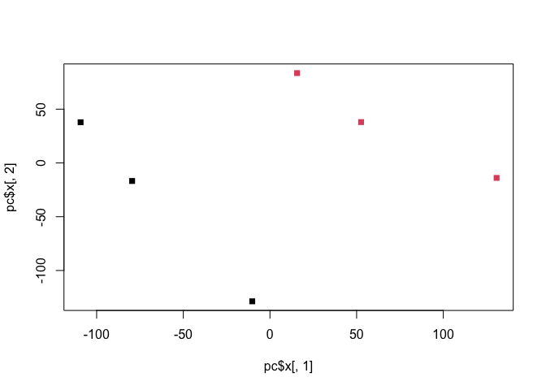
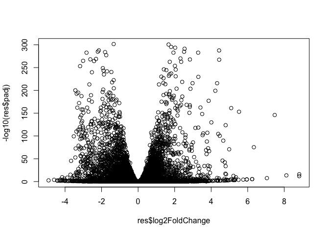
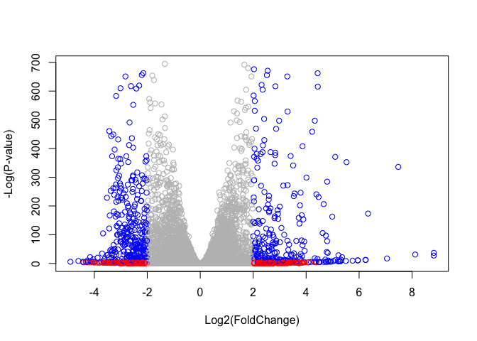
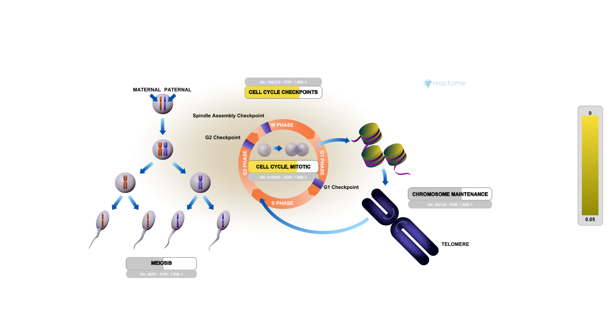

# Class 14
Jason Hsiao (PID: A15871650)

- [Tidying input data](#tidying-input-data)
- [Running DESeq2](#running-deseq2)
- [QC with PCA](#qc-with-pca)
- [Volcano Plot](#volcano-plot)
- [Adding Gene Annotation](#adding-gene-annotation)
- [Pathway Analysis](#pathway-analysis)
- [Gene Ontology (GO) Pathway
  Analysis](#gene-ontology-go-pathway-analysis)
- [Reactome Analysis](#reactome-analysis)
- [GO online](#go-online)

## Tidying input data

Importing Files

``` r
# Import metadata and take a peak
colData = read.csv("GSE37704_metadata.csv", row.names = 1)
head(colData)
```

                  condition
    SRR493366 control_sirna
    SRR493367 control_sirna
    SRR493368 control_sirna
    SRR493369      hoxa1_kd
    SRR493370      hoxa1_kd
    SRR493371      hoxa1_kd

``` r
# Import countdata
countData = read.csv("GSE37704_featurecounts.csv", row.names = 1)
head(countData)
```

                    length SRR493366 SRR493367 SRR493368 SRR493369 SRR493370
    ENSG00000186092    918         0         0         0         0         0
    ENSG00000279928    718         0         0         0         0         0
    ENSG00000279457   1982        23        28        29        29        28
    ENSG00000278566    939         0         0         0         0         0
    ENSG00000273547    939         0         0         0         0         0
    ENSG00000187634   3214       124       123       205       207       212
                    SRR493371
    ENSG00000186092         0
    ENSG00000279928         0
    ENSG00000279457        46
    ENSG00000278566         0
    ENSG00000273547         0
    ENSG00000187634       258

Cleaning Up Count Data

``` r
# Removing length column from countData
countData <- as.matrix(countData[, -1])
head(countData)
```

                    SRR493366 SRR493367 SRR493368 SRR493369 SRR493370 SRR493371
    ENSG00000186092         0         0         0         0         0         0
    ENSG00000279928         0         0         0         0         0         0
    ENSG00000279457        23        28        29        29        28        46
    ENSG00000278566         0         0         0         0         0         0
    ENSG00000273547         0         0         0         0         0         0
    ENSG00000187634       124       123       205       207       212       258

``` r
# Filter count data where you have 0 read count across all samples.
counts <- subset(countData, rowSums(countData) > 0)
head(counts)
```

                    SRR493366 SRR493367 SRR493368 SRR493369 SRR493370 SRR493371
    ENSG00000279457        23        28        29        29        28        46
    ENSG00000187634       124       123       205       207       212       258
    ENSG00000188976      1637      1831      2383      1226      1326      1504
    ENSG00000187961       120       153       180       236       255       357
    ENSG00000187583        24        48        65        44        48        64
    ENSG00000187642         4         9        16        14        16        16

## Running DESeq2

``` r
library(DESeq2)
```

    Loading required package: S4Vectors

    Loading required package: stats4

    Loading required package: BiocGenerics


    Attaching package: 'BiocGenerics'

    The following objects are masked from 'package:stats':

        IQR, mad, sd, var, xtabs

    The following objects are masked from 'package:base':

        anyDuplicated, aperm, append, as.data.frame, basename, cbind,
        colnames, dirname, do.call, duplicated, eval, evalq, Filter, Find,
        get, grep, grepl, intersect, is.unsorted, lapply, Map, mapply,
        match, mget, order, paste, pmax, pmax.int, pmin, pmin.int,
        Position, rank, rbind, Reduce, rownames, sapply, setdiff, sort,
        table, tapply, union, unique, unsplit, which.max, which.min


    Attaching package: 'S4Vectors'

    The following object is masked from 'package:utils':

        findMatches

    The following objects are masked from 'package:base':

        expand.grid, I, unname

    Loading required package: IRanges

    Loading required package: GenomicRanges

    Loading required package: GenomeInfoDb

    Loading required package: SummarizedExperiment

    Loading required package: MatrixGenerics

    Loading required package: matrixStats


    Attaching package: 'MatrixGenerics'

    The following objects are masked from 'package:matrixStats':

        colAlls, colAnyNAs, colAnys, colAvgsPerRowSet, colCollapse,
        colCounts, colCummaxs, colCummins, colCumprods, colCumsums,
        colDiffs, colIQRDiffs, colIQRs, colLogSumExps, colMadDiffs,
        colMads, colMaxs, colMeans2, colMedians, colMins, colOrderStats,
        colProds, colQuantiles, colRanges, colRanks, colSdDiffs, colSds,
        colSums2, colTabulates, colVarDiffs, colVars, colWeightedMads,
        colWeightedMeans, colWeightedMedians, colWeightedSds,
        colWeightedVars, rowAlls, rowAnyNAs, rowAnys, rowAvgsPerColSet,
        rowCollapse, rowCounts, rowCummaxs, rowCummins, rowCumprods,
        rowCumsums, rowDiffs, rowIQRDiffs, rowIQRs, rowLogSumExps,
        rowMadDiffs, rowMads, rowMaxs, rowMeans2, rowMedians, rowMins,
        rowOrderStats, rowProds, rowQuantiles, rowRanges, rowRanks,
        rowSdDiffs, rowSds, rowSums2, rowTabulates, rowVarDiffs, rowVars,
        rowWeightedMads, rowWeightedMeans, rowWeightedMedians,
        rowWeightedSds, rowWeightedVars

    Loading required package: Biobase

    Welcome to Bioconductor

        Vignettes contain introductory material; view with
        'browseVignettes()'. To cite Bioconductor, see
        'citation("Biobase")', and for packages 'citation("pkgname")'.


    Attaching package: 'Biobase'

    The following object is masked from 'package:MatrixGenerics':

        rowMedians

    The following objects are masked from 'package:matrixStats':

        anyMissing, rowMedians

``` r
dds = DESeqDataSetFromMatrix(countData=countData,
                             colData=colData,
                             design=~condition)
```

    Warning in DESeqDataSet(se, design = design, ignoreRank): some variables in
    design formula are characters, converting to factors

``` r
dds = DESeq(dds)
```

    estimating size factors

    estimating dispersions

    gene-wise dispersion estimates

    mean-dispersion relationship

    final dispersion estimates

    fitting model and testing

``` r
res = results(dds)

summary(res)
```


    out of 15975 with nonzero total read count
    adjusted p-value < 0.1
    LFC > 0 (up)       : 4349, 27%
    LFC < 0 (down)     : 4393, 27%
    outliers [1]       : 0, 0%
    low counts [2]     : 1221, 7.6%
    (mean count < 0)
    [1] see 'cooksCutoff' argument of ?results
    [2] see 'independentFiltering' argument of ?results

## QC with PCA

``` r
pc <- prcomp(t(counts), scale = T)

summary(pc)
```

    Importance of components:
                               PC1     PC2      PC3      PC4      PC5       PC6
    Standard deviation     87.7211 73.3196 32.89604 31.15094 29.18417 7.387e-13
    Proportion of Variance  0.4817  0.3365  0.06774  0.06074  0.05332 0.000e+00
    Cumulative Proportion   0.4817  0.8182  0.88594  0.94668  1.00000 1.000e+00

``` r
plot(pc$x[,1], pc$x[,2], col = as.factor(colData$condition), pch = 15)
```



## Volcano Plot

``` r
plot(res$log2FoldChange, -log10(res$padj))
```



``` r
# Make a color vector for all genes
mycols <- rep("gray", nrow(res) )

# Color red the genes with absolute fold change above 2
mycols[ abs(res$log2FoldChange) > 2 ] <- "red"

# Color blue those with adjusted p-value less than 0.01
#  and absolute fold change more than 2
inds <- (res$padj < 0.01) & (abs(res$log2FoldChange) > 2 )
mycols[ inds ] <- "blue"

plot( res$log2FoldChange, -log(res$padj), col = mycols, xlab = "Log2(FoldChange)", ylab = "-Log(P-value)" )
```



## Adding Gene Annotation

``` r
library("AnnotationDbi")
library("org.Hs.eg.db")
```

``` r
columns(org.Hs.eg.db)
```

     [1] "ACCNUM"       "ALIAS"        "ENSEMBL"      "ENSEMBLPROT"  "ENSEMBLTRANS"
     [6] "ENTREZID"     "ENZYME"       "EVIDENCE"     "EVIDENCEALL"  "GENENAME"    
    [11] "GENETYPE"     "GO"           "GOALL"        "IPI"          "MAP"         
    [16] "OMIM"         "ONTOLOGY"     "ONTOLOGYALL"  "PATH"         "PFAM"        
    [21] "PMID"         "PROSITE"      "REFSEQ"       "SYMBOL"       "UCSCKG"      
    [26] "UNIPROT"     

``` r
res$symbol = mapIds(org.Hs.eg.db,
                    keys = row.names(res), 
                    keytype = "ENSEMBL",
                    column = "SYMBOL",
                    multiVals = "first")
```

    'select()' returned 1:many mapping between keys and columns

``` r
res$entrez = mapIds(org.Hs.eg.db,
                    keys = row.names(res),
                    keytype = "ENSEMBL",
                    column = "ENTREZID",
                    multiVals = "first")
```

    'select()' returned 1:many mapping between keys and columns

``` r
res$name =   mapIds(org.Hs.eg.db,
                    keys = row.names(res),
                    keytype = "ENSEMBL",
                    column = "GENENAME",
                    multiVals = "first")
```

    'select()' returned 1:many mapping between keys and columns

``` r
head(res, 10)
```

    log2 fold change (MLE): condition hoxa1 kd vs control sirna 
    Wald test p-value: condition hoxa1 kd vs control sirna 
    DataFrame with 10 rows and 9 columns
                     baseMean log2FoldChange     lfcSE       stat      pvalue
                    <numeric>      <numeric> <numeric>  <numeric>   <numeric>
    ENSG00000186092    0.0000             NA        NA         NA          NA
    ENSG00000279928    0.0000             NA        NA         NA          NA
    ENSG00000279457   29.9136      0.1792571 0.3248216   0.551863 5.81042e-01
    ENSG00000278566    0.0000             NA        NA         NA          NA
    ENSG00000273547    0.0000             NA        NA         NA          NA
    ENSG00000187634  183.2296      0.4264571 0.1402658   3.040350 2.36304e-03
    ENSG00000188976 1651.1881     -0.6927205 0.0548465 -12.630158 1.43989e-36
    ENSG00000187961  209.6379      0.7297556 0.1318599   5.534326 3.12428e-08
    ENSG00000187583   47.2551      0.0405765 0.2718928   0.149237 8.81366e-01
    ENSG00000187642   11.9798      0.5428105 0.5215599   1.040744 2.97994e-01
                           padj      symbol      entrez                   name
                      <numeric> <character> <character>            <character>
    ENSG00000186092          NA       OR4F5       79501 olfactory receptor f..
    ENSG00000279928          NA          NA          NA                     NA
    ENSG00000279457 6.87080e-01          NA          NA                     NA
    ENSG00000278566          NA          NA          NA                     NA
    ENSG00000273547          NA          NA          NA                     NA
    ENSG00000187634 5.16278e-03      SAMD11      148398 sterile alpha motif ..
    ENSG00000188976 1.76740e-35       NOC2L       26155 NOC2 like nucleolar ..
    ENSG00000187961 1.13536e-07      KLHL17      339451 kelch like family me..
    ENSG00000187583 9.18988e-01     PLEKHN1       84069 pleckstrin homology ..
    ENSG00000187642 4.03817e-01       PERM1       84808 PPARGC1 and ESRR ind..

Writing Results into a CSV

``` r
res = res[order(res$pvalue),]
write.csv(res, file = "deseq_results.csv")
```

## Pathway Analysis

``` r
library(pathview)
library(gage)
library(gageData)

# The gageData package has pre-compiled databases mapping genes to KEGG pathways and GO terms for common organisms. kegg.sets.hs is a named list of 229 elements. Each element is a character vector of member gene Entrez IDs for a single KEGG pathway.
data(kegg.sets.hs)

# The main gage() function requires a named vector of fold changes, where the names of the values are the Entrez gene IDs.

# Note that we used the mapIDs() function above to obtain Entrez gene IDs (stored in `res$entrez`) and we have the fold change results from DESeq2 analysis (stored in `res$log2FoldChange`).
foldchanges = res$log2FoldChange
names(foldchanges) = res$entrez
head(foldchanges)
```

         1266     54855      1465     51232      2034      2317 
    -2.422719  3.201955 -2.313738 -2.059631 -1.888019 -1.649792 

``` r
# Run the gage function!
keggres = gage(foldchanges, gsets = kegg.sets.hs)
```

Inspect keggres:

``` r
attributes(keggres)
```

    $names
    [1] "greater" "less"    "stats"  

``` r
# Look at the first few down (less) pathways
head(keggres$less)
```

                                                      p.geomean stat.mean
    hsa04110 Cell cycle                            7.077982e-06 -4.432593
    hsa03030 DNA replication                       9.424076e-05 -3.951803
    hsa05130 Pathogenic Escherichia coli infection 1.076420e-04 -3.835716
    hsa03013 RNA transport                         1.160132e-03 -3.080629
    hsa04114 Oocyte meiosis                        2.563806e-03 -2.827297
    hsa03440 Homologous recombination              3.066756e-03 -2.852899
                                                          p.val       q.val
    hsa04110 Cell cycle                            7.077982e-06 0.001507610
    hsa03030 DNA replication                       9.424076e-05 0.007642585
    hsa05130 Pathogenic Escherichia coli infection 1.076420e-04 0.007642585
    hsa03013 RNA transport                         1.160132e-03 0.061777023
    hsa04114 Oocyte meiosis                        2.563806e-03 0.108869849
    hsa03440 Homologous recombination              3.066756e-03 0.108869849
                                                   set.size         exp1
    hsa04110 Cell cycle                                 124 7.077982e-06
    hsa03030 DNA replication                             36 9.424076e-05
    hsa05130 Pathogenic Escherichia coli infection       55 1.076420e-04
    hsa03013 RNA transport                              149 1.160132e-03
    hsa04114 Oocyte meiosis                             112 2.563806e-03
    hsa03440 Homologous recombination                    28 3.066756e-03

``` r
# Look at the first few up (greater) pathways
head(keggres$greater)
```

                                                       p.geomean stat.mean
    hsa04740 Olfactory transduction                 6.252190e-08  5.353017
    hsa04060 Cytokine-cytokine receptor interaction 8.703597e-08  5.313429
    hsa05323 Rheumatoid arthritis                   4.392802e-05  4.030693
    hsa05332 Graft-versus-host disease              1.685049e-04  3.771387
    hsa04640 Hematopoietic cell lineage             2.654205e-04  3.542990
    hsa05320 Autoimmune thyroid disease             3.092317e-04  3.540808
                                                           p.val        q.val
    hsa04740 Olfactory transduction                 6.252190e-08 9.269331e-06
    hsa04060 Cytokine-cytokine receptor interaction 8.703597e-08 9.269331e-06
    hsa05323 Rheumatoid arthritis                   4.392802e-05 3.118889e-03
    hsa05332 Graft-versus-host disease              1.685049e-04 8.972885e-03
    hsa04640 Hematopoietic cell lineage             2.654205e-04 1.097773e-02
    hsa05320 Autoimmune thyroid disease             3.092317e-04 1.097773e-02
                                                    set.size         exp1
    hsa04740 Olfactory transduction                      355 6.252190e-08
    hsa04060 Cytokine-cytokine receptor interaction      263 8.703597e-08
    hsa05323 Rheumatoid arthritis                         87 4.392802e-05
    hsa05332 Graft-versus-host disease                    36 1.685049e-04
    hsa04640 Hematopoietic cell lineage                   86 2.654205e-04
    hsa05320 Autoimmune thyroid disease                   49 3.092317e-04

Putting this together in pathview in a diagram of cell cycle ONLY

``` r
pathview(gene.data = foldchanges, pathway.id = "hsa04110")
```

    'select()' returned 1:1 mapping between keys and columns

    Info: Working in directory /Users/jasonhsiao/Library/CloudStorage/OneDrive-UCSanDiego/Grad/F23_Bioinformatics_BGGN213/BGGN213_F23/Class 14

    Info: Writing image file hsa04110.pathview.png

Now, let’s process our results a bit more to automagicaly pull out the
top 5 upregulated pathways, then further process that just to get the
pathway IDs needed by the `pathview()` function. We’ll use these KEGG
pathway IDs for pathview plotting below.

``` r
## Focus on top 5 upregulated pathways here for demo purposes only
keggrespathways <- rownames(keggres$greater)[1:5]

# Extract the 8 character long IDs part of each string
keggresids = substr(keggrespathways, start=1, stop=8)
keggresids
```

    [1] "hsa04740" "hsa04060" "hsa05323" "hsa05332" "hsa04640"

``` r
#Graphing it...
pathview(gene.data=foldchanges, pathway.id=keggresids, species="hsa")
```

    'select()' returned 1:1 mapping between keys and columns

    Info: Working in directory /Users/jasonhsiao/Library/CloudStorage/OneDrive-UCSanDiego/Grad/F23_Bioinformatics_BGGN213/BGGN213_F23/Class 14

    Info: Writing image file hsa04740.pathview.png

    Info: some node width is different from others, and hence adjusted!

    'select()' returned 1:1 mapping between keys and columns

    Info: Working in directory /Users/jasonhsiao/Library/CloudStorage/OneDrive-UCSanDiego/Grad/F23_Bioinformatics_BGGN213/BGGN213_F23/Class 14

    Info: Writing image file hsa04060.pathview.png

    'select()' returned 1:1 mapping between keys and columns

    Info: Working in directory /Users/jasonhsiao/Library/CloudStorage/OneDrive-UCSanDiego/Grad/F23_Bioinformatics_BGGN213/BGGN213_F23/Class 14

    Info: Writing image file hsa05323.pathview.png

    'select()' returned 1:1 mapping between keys and columns

    Info: Working in directory /Users/jasonhsiao/Library/CloudStorage/OneDrive-UCSanDiego/Grad/F23_Bioinformatics_BGGN213/BGGN213_F23/Class 14

    Info: Writing image file hsa05332.pathview.png

    'select()' returned 1:1 mapping between keys and columns

    Info: Working in directory /Users/jasonhsiao/Library/CloudStorage/OneDrive-UCSanDiego/Grad/F23_Bioinformatics_BGGN213/BGGN213_F23/Class 14

    Info: Writing image file hsa04640.pathview.png

## Gene Ontology (GO) Pathway Analysis

``` r
data(go.sets.hs)
data(go.subs.hs)

# Focus on Biological Process subset of GO
gobpsets = go.sets.hs[go.subs.hs$BP]

gobpres = gage(foldchanges, gsets=gobpsets, same.dir=TRUE)

lapply(gobpres, head)
```

    $greater
                                                  p.geomean stat.mean        p.val
    GO:0007156 homophilic cell adhesion        1.624062e-05  4.226117 1.624062e-05
    GO:0048729 tissue morphogenesis            5.407952e-05  3.888470 5.407952e-05
    GO:0002009 morphogenesis of an epithelium  5.727599e-05  3.878706 5.727599e-05
    GO:0030855 epithelial cell differentiation 2.053700e-04  3.554776 2.053700e-04
    GO:0060562 epithelial tube morphogenesis   2.927804e-04  3.458463 2.927804e-04
    GO:0048598 embryonic morphogenesis         2.959270e-04  3.446527 2.959270e-04
                                                    q.val set.size         exp1
    GO:0007156 homophilic cell adhesion        0.07100398      138 1.624062e-05
    GO:0048729 tissue morphogenesis            0.08347021      483 5.407952e-05
    GO:0002009 morphogenesis of an epithelium  0.08347021      382 5.727599e-05
    GO:0030855 epithelial cell differentiation 0.16449701      299 2.053700e-04
    GO:0060562 epithelial tube morphogenesis   0.16449701      289 2.927804e-04
    GO:0048598 embryonic morphogenesis         0.16449701      498 2.959270e-04

    $less
                                                p.geomean stat.mean        p.val
    GO:0048285 organelle fission             6.626774e-16 -8.170439 6.626774e-16
    GO:0000280 nuclear division              1.797050e-15 -8.051200 1.797050e-15
    GO:0007067 mitosis                       1.797050e-15 -8.051200 1.797050e-15
    GO:0000087 M phase of mitotic cell cycle 4.757263e-15 -7.915080 4.757263e-15
    GO:0007059 chromosome segregation        1.081862e-11 -6.974546 1.081862e-11
    GO:0051301 cell division                 8.718528e-11 -6.455491 8.718528e-11
                                                    q.val set.size         exp1
    GO:0048285 organelle fission             2.618901e-12      386 6.626774e-16
    GO:0000280 nuclear division              2.618901e-12      362 1.797050e-15
    GO:0007067 mitosis                       2.618901e-12      362 1.797050e-15
    GO:0000087 M phase of mitotic cell cycle 5.199689e-12      373 4.757263e-15
    GO:0007059 chromosome segregation        9.459800e-09      146 1.081862e-11
    GO:0051301 cell division                 6.352901e-08      479 8.718528e-11

    $stats
                                               stat.mean     exp1
    GO:0007156 homophilic cell adhesion         4.226117 4.226117
    GO:0048729 tissue morphogenesis             3.888470 3.888470
    GO:0002009 morphogenesis of an epithelium   3.878706 3.878706
    GO:0030855 epithelial cell differentiation  3.554776 3.554776
    GO:0060562 epithelial tube morphogenesis    3.458463 3.458463
    GO:0048598 embryonic morphogenesis          3.446527 3.446527

## Reactome Analysis

First, Using R, output the list of significant genes at the 0.05 level
as a plain text file:

``` r
sig_genes <- res[res$padj <= 0.05 & !is.na(res$padj), "symbol"]
print(paste("Total number of significant genes:", length(sig_genes)))
```

    [1] "Total number of significant genes: 8146"

``` r
write.table(sig_genes, file="significant_genes.txt", row.names=FALSE, col.names=FALSE, quote=FALSE)
```

Then, to perform pathway analysis online go to the Reactome website:
(https://reactome.org/PathwayBrowser/#TOOL=AT). Select “choose file” to
upload your significant gene list. Then, select the parameters “Project
to Humans”, then click “Analyze”.

> Q: What pathway has the most significant “Entities p-value”? Do the
> most significant pathways listed match your previous KEGG results?
> What factors could cause differences between the two methods?

A: Cell Cycle! 

The most significant pathways are roughly similar, but not the exact
same. The difference is probably from the way pathways are defined, and
also the fundamental data structures of the respective pathway analyses
are different.

## GO online

To perform Gene Set GO Enrichment online go to the website:
http://www.geneontology.org/page/go-enrichment-analysis. Paste your
significant gene list from section 4. Then, select “biological process”
and “homo sapiens”, and click submit.

> Q: What pathway has the most significant “Entities p-value”? Do the
> most significant pathways listed match your previous KEGG results?
> What factors could cause differences between the two methods?

A: “Unclassified”. The most significant pathways don’t really match KEGG
results. The most significant pathways are roughly similar, but not the
exact same. The difference is probably from the way pathways are
defined, and also the fundamental data structures of the respective
pathway analyses are different.
