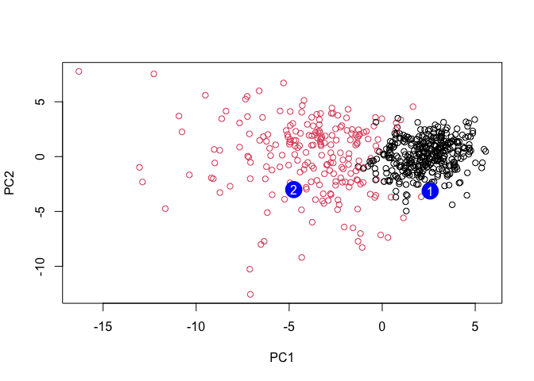

# Class 9
Jason Hsiao (PID: A15871650)

## Importing Data and Preparing

``` r
# Save your input data file into your Project directory
fna.data <- "WisconsinCancer.csv"

# Complete the following code to input the data and store as wisc.df
wisc.df <- read.csv(fna.data, row.names=1)

# We can use -1 here to remove the first column so we don't have answers
wisc.data <- wisc.df[,-1]

# Create diagnosis vector to store answer for later
diagnosis <- as.factor(wisc.df$diagnosis)
```

> Q1. How many observations are in this dataset?

``` r
nrow(wisc.data)
```

    [1] 569

> Q2. How many of the observations have a malignant diagnosis?

``` r
sum(diagnosis == "M")
```

    [1] 212

> Q3. How many variables/features in the data are suffixed with \_mean?

``` r
length(grep("_mean", colnames(wisc.df)))
```

    [1] 10

## Check column means and standard deviations

``` r
colMeans(wisc.data)
```

                radius_mean            texture_mean          perimeter_mean 
               1.412729e+01            1.928965e+01            9.196903e+01 
                  area_mean         smoothness_mean        compactness_mean 
               6.548891e+02            9.636028e-02            1.043410e-01 
             concavity_mean     concave.points_mean           symmetry_mean 
               8.879932e-02            4.891915e-02            1.811619e-01 
     fractal_dimension_mean               radius_se              texture_se 
               6.279761e-02            4.051721e-01            1.216853e+00 
               perimeter_se                 area_se           smoothness_se 
               2.866059e+00            4.033708e+01            7.040979e-03 
             compactness_se            concavity_se       concave.points_se 
               2.547814e-02            3.189372e-02            1.179614e-02 
                symmetry_se    fractal_dimension_se            radius_worst 
               2.054230e-02            3.794904e-03            1.626919e+01 
              texture_worst         perimeter_worst              area_worst 
               2.567722e+01            1.072612e+02            8.805831e+02 
           smoothness_worst       compactness_worst         concavity_worst 
               1.323686e-01            2.542650e-01            2.721885e-01 
       concave.points_worst          symmetry_worst fractal_dimension_worst 
               1.146062e-01            2.900756e-01            8.394582e-02 

``` r
apply(wisc.data, 2, sd)
```

                radius_mean            texture_mean          perimeter_mean 
               3.524049e+00            4.301036e+00            2.429898e+01 
                  area_mean         smoothness_mean        compactness_mean 
               3.519141e+02            1.406413e-02            5.281276e-02 
             concavity_mean     concave.points_mean           symmetry_mean 
               7.971981e-02            3.880284e-02            2.741428e-02 
     fractal_dimension_mean               radius_se              texture_se 
               7.060363e-03            2.773127e-01            5.516484e-01 
               perimeter_se                 area_se           smoothness_se 
               2.021855e+00            4.549101e+01            3.002518e-03 
             compactness_se            concavity_se       concave.points_se 
               1.790818e-02            3.018606e-02            6.170285e-03 
                symmetry_se    fractal_dimension_se            radius_worst 
               8.266372e-03            2.646071e-03            4.833242e+00 
              texture_worst         perimeter_worst              area_worst 
               6.146258e+00            3.360254e+01            5.693570e+02 
           smoothness_worst       compactness_worst         concavity_worst 
               2.283243e-02            1.573365e-01            2.086243e-01 
       concave.points_worst          symmetry_worst fractal_dimension_worst 
               6.573234e-02            6.186747e-02            1.806127e-02 

## PCA

``` r
# Perform PCA on wisc.data by completing the following code
wisc.pr <- prcomp(wisc.data, scale = TRUE)

# Look at summary of results
summary(wisc.pr)
```

    Importance of components:
                              PC1    PC2     PC3     PC4     PC5     PC6     PC7
    Standard deviation     3.6444 2.3857 1.67867 1.40735 1.28403 1.09880 0.82172
    Proportion of Variance 0.4427 0.1897 0.09393 0.06602 0.05496 0.04025 0.02251
    Cumulative Proportion  0.4427 0.6324 0.72636 0.79239 0.84734 0.88759 0.91010
                               PC8    PC9    PC10   PC11    PC12    PC13    PC14
    Standard deviation     0.69037 0.6457 0.59219 0.5421 0.51104 0.49128 0.39624
    Proportion of Variance 0.01589 0.0139 0.01169 0.0098 0.00871 0.00805 0.00523
    Cumulative Proportion  0.92598 0.9399 0.95157 0.9614 0.97007 0.97812 0.98335
                              PC15    PC16    PC17    PC18    PC19    PC20   PC21
    Standard deviation     0.30681 0.28260 0.24372 0.22939 0.22244 0.17652 0.1731
    Proportion of Variance 0.00314 0.00266 0.00198 0.00175 0.00165 0.00104 0.0010
    Cumulative Proportion  0.98649 0.98915 0.99113 0.99288 0.99453 0.99557 0.9966
                              PC22    PC23   PC24    PC25    PC26    PC27    PC28
    Standard deviation     0.16565 0.15602 0.1344 0.12442 0.09043 0.08307 0.03987
    Proportion of Variance 0.00091 0.00081 0.0006 0.00052 0.00027 0.00023 0.00005
    Cumulative Proportion  0.99749 0.99830 0.9989 0.99942 0.99969 0.99992 0.99997
                              PC29    PC30
    Standard deviation     0.02736 0.01153
    Proportion of Variance 0.00002 0.00000
    Cumulative Proportion  1.00000 1.00000

> Q4. From your results, what proportion of the original variance is
> captured by the first principal components (PC1)?

44.27%

> Q5. How many principal components (PCs) are required to describe at
> least 70% of the original variance in the data?

PC3

> Q6. How many principal components (PCs) are required to describe at
> least 90% of the original variance in the data?

PC7

## Interpreting PCA Results

``` r
biplot(wisc.pr$x, wisc.pr$rotation)
```


> Q7. What stands out to you about this plot? Is it easy or difficult to
> understand? Why?

Extremely difficult to understand, since all the numbers and words are
overlapped and there is no meaningful value to this plot.

We want to generate a better plot:

``` r
# Scatter plot observations by components 1 and 2
plot(wisc.pr$x[, 1], wisc.pr$x[, 2], col = diagnosis, 
     xlab = "PC1", ylab = "PC2")
```


``` r
# Repeat for components 1 and 3
plot(wisc.pr$x[, 1], wisc.pr$x[, 3], col = diagnosis, 
     xlab = "PC1", ylab = "PC3")
```


Let’s put this in ggplot2

``` r
# Create a data.frame for ggplot
df <- as.data.frame(wisc.pr$x)
df$diagnosis <- diagnosis

# Load the ggplot2 package
library(ggplot2)

# Make a scatter plot colored by diagnosis
ggplot(df) + 
  aes(PC1, PC2, col = diagnosis) + 
  geom_point()
```


## Variance Explained

``` r
# Calculate variance of each component
pr.var <- wisc.pr$sdev^2
head(pr.var)
```

    [1] 13.281608  5.691355  2.817949  1.980640  1.648731  1.207357

## Scree Plot

``` r
# Variance explained by each principal component: pve
total_sdev <- sum(pr.var)

# PVE 
pve <- pr.var / total_sdev

# Plot variance explained for each principal component
plot(pve, xlab = "Principal Component", 
     ylab = "Proportion of Variance Explained", 
     ylim = c(0, 1), type = "o")
```


``` r
# Alternative scree plot of the same data, note data driven y-axis
barplot(pve, ylab = "Precent of Variance Explained",
     names.arg=paste0("PC",1:length(pve)), las=2, axes = FALSE)
axis(2, at=pve, labels=round(pve,2)*100 )
```


``` r
## ggplot based graph using factoextra package
library(factoextra)
```

    Welcome! Want to learn more? See two factoextra-related books at https://goo.gl/ve3WBa

``` r
fviz_eig(wisc.pr, addlabels = TRUE)
```


> Q9. For the first principal component, what is the component of the
> loading vector (i.e. wisc.pr\$rotation\[,1\]) for the feature
> concave.points_mean? This tells us how much this original feature
> contributes to the first PC.

``` r
bar_centers <- barplot( wisc.pr$rotation[,1], las=2 )
text(x = bar_centers, 
     y = wisc.pr$rotation[,1],
     labels = round(wisc.pr$rotation[,1], 2),
     pos = 3, cex = 0.8)
```


-0.26

## Hierarchical Clustering

``` r
# Scale the wisc.data data using the "scale()" function
data.scaled <- scale(wisc.data)

#Calculate the (Euclidean) distances between all pairs of observations in the new scaled dataset and assign the result to data.dist.
data.dist <- dist(data.scaled)

#Create a hierarchical clustering model using complete linkage. 
wisc.hclust <- hclust(data.dist, method = "ward.D2")
```

> Q10. Using the plot() and abline() functions, what is the height at
> which the clustering model has 4 clusters?

``` r
plot(wisc.hclust)

# Cut the dendrogram into 4 clusters
clusters <- cutree(wisc.hclust, k = 4)
abline(wisc.hclust, h = 32
       , col="red", lty=2)
```


32?

> Q12. Which method gives your favorite results for the same data.dist
> dataset? Explain your reasoning.

Cluster dendrogram, provides a good visualization of where clustering
occurs.

> Q13. How well does the newly created model with four clusters separate
> out the two diagnoses?

``` r
wisc.pr.hclust <- hclust(dist(wisc.pr$x[, 1:7]), method="ward.D2")
grouped <- cutree(wisc.pr.hclust, k = 4)

#Visualizing as table
table(grouped, diagnosis)
```

           diagnosis
    grouped   B   M
          1   0  45
          2   2  77
          3  26  66
          4 329  24

Better! Groups 1/2 are more predictive of malignant and groups 3/4 are
more predictive of benign. However, there are still many malignant
specimens in groups 3/4.

> Q14. How well do the hierarchical clustering models you created in
> previous sections (i.e. before PCA) do in terms of separating the
> diagnoses? Again, use the table() function to compare the output of
> each model (wisc.km\$cluster and wisc.hclust.clusters) with the vector
> containing the actual diagnoses.

``` r
#PCA then hierarchical clustering
wisc.pr.hclust.clusters <- cutree(wisc.pr.hclust, k = 2)
table(wisc.pr.hclust.clusters, diagnosis)
```

                           diagnosis
    wisc.pr.hclust.clusters   B   M
                          1  28 188
                          2 329  24

``` r
#hierarchical clustering (4 cluster)
table(grouped, diagnosis)
```

           diagnosis
    grouped   B   M
          1   0  45
          2   2  77
          3  26  66
          4 329  24

``` r
#kmeans
wisc.km <- kmeans(wisc.data, 2) #asking for 2 clusters
table(wisc.km$cluster, diagnosis)
```

       diagnosis
          B   M
      1 356  82
      2   1 130

PCA then hierarchical clustering appears to be the best

> Q16. Which of these new patients should we prioritize for follow up
> based on your results?

``` r
#url <- "new_samples.csv"
url <- "https://tinyurl.com/new-samples-CSV"
new <- read.csv(url)
npc <- predict(wisc.pr, newdata=new)
npc
```

               PC1       PC2        PC3        PC4       PC5        PC6        PC7
    [1,]  2.576616 -3.135913  1.3990492 -0.7631950  2.781648 -0.8150185 -0.3959098
    [2,] -4.754928 -3.009033 -0.1660946 -0.6052952 -1.140698 -1.2189945  0.8193031
                PC8       PC9       PC10      PC11      PC12      PC13     PC14
    [1,] -0.2307350 0.1029569 -0.9272861 0.3411457  0.375921 0.1610764 1.187882
    [2,] -0.3307423 0.5281896 -0.4855301 0.7173233 -1.185917 0.5893856 0.303029
              PC15       PC16        PC17        PC18        PC19       PC20
    [1,] 0.3216974 -0.1743616 -0.07875393 -0.11207028 -0.08802955 -0.2495216
    [2,] 0.1299153  0.1448061 -0.40509706  0.06565549  0.25591230 -0.4289500
               PC21       PC22       PC23       PC24        PC25         PC26
    [1,]  0.1228233 0.09358453 0.08347651  0.1223396  0.02124121  0.078884581
    [2,] -0.1224776 0.01732146 0.06316631 -0.2338618 -0.20755948 -0.009833238
                 PC27        PC28         PC29         PC30
    [1,]  0.220199544 -0.02946023 -0.015620933  0.005269029
    [2,] -0.001134152  0.09638361  0.002795349 -0.019015820

``` r
g <- as.factor(wisc.pr.hclust.clusters)
levels(g)
```

    [1] "1" "2"

``` r
## [1] "1" "2"
g <- relevel(g,2)
levels(g)
```

    [1] "2" "1"

``` r
## [1] "2" "1"
# Plot using our re-ordered factor 
plot(wisc.pr$x[,1:2], col=g)

plot(wisc.pr$x[,1:2], col=g)
points(npc[,1], npc[,2], col="blue", pch=16, cex=3)
text(npc[,1], npc[,2], c(1,2), col="white")
```



Group 2, these are the malignant patients and get follow up
