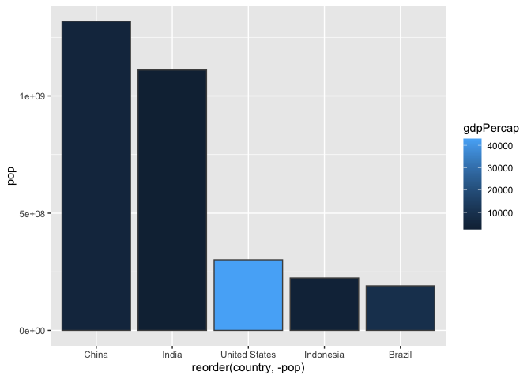

# Class 5: Data Visualization with ggplot
Jason Hsiao (PID: A15871650)

## Using ggplot

To use ggplot2 we first need to install it on our computers. To do this
we will use the function `install.packages()`

There is always the “base R” graphics system, i.e. `plot()`

``` r
plot(cars)
```


To use ggplot I need to spell out at least 3 things: - data - aesthetics
(aes() values - how the data/vectors map to the plot) - geoms (how I
want things drawn, defined by different independent functions)

## Visualizing ‘Cars’ Dataset Using ggplot

``` r
ggplot(cars) +
  aes(x = speed, y = dist) +
  geom_point() + 
  geom_smooth(method = "lm") +
  theme_bw()
```

    `geom_smooth()` using formula = 'y ~ x'


## Analyzing and Visualizing Differential Gene Analysis Data

``` r
#Importing Data
url <- "https://bioboot.github.io/bimm143_S20/class-material/up_down_expression.txt"
genes <- read.delim(url)
head(genes)
```

            Gene Condition1 Condition2      State
    1      A4GNT -3.6808610 -3.4401355 unchanging
    2       AAAS  4.5479580  4.3864126 unchanging
    3      AASDH  3.7190695  3.4787276 unchanging
    4       AATF  5.0784720  5.0151916 unchanging
    5       AATK  0.4711421  0.5598642 unchanging
    6 AB015752.4 -3.6808610 -3.5921390 unchanging

``` r
#Understanding row and columns of genes object
nrow(genes)
```

    [1] 5196

``` r
ncol(genes)
```

    [1] 4

``` r
#Percent of total genes upregulated
percent.upregulated <- sum(genes$State == "up")/nrow(genes)*100
percent.upregulated
```

    [1] 2.444188

``` r
#Generating a Scatterplot 
plot <- 
  ggplot(genes) +
  aes(x = Condition1, y = Condition2, col = State) +
  geom_point()

plot + scale_color_manual(values = c("blue", "gray", "red")) +
  labs(title = "Gene Expression Changes Upon Drug Treatment",
       x = "Control (no drug)",
       y = "Drug Treatment"
       )
```


## Exploring gapminder dataset - Scatterplot

``` r
library(gapminder)
library(dplyr)
```


    Attaching package: 'dplyr'

    The following objects are masked from 'package:stats':

        filter, lag

    The following objects are masked from 'package:base':

        intersect, setdiff, setequal, union

``` r
#Filtering for 2007 Dataset 
gapminder_2007 <- gapminder %>% filter(year==2007)

#Plotting Life Expectancy vs. GDP Per Capita as of 2007 
ggplot(gapminder_2007) +
  aes(x = gdpPercap, y = lifeExp, col = continent, size = pop) +
  geom_point(alpha = 0.5) +
  labs(title = "Life Expectancy vs. GDP Per Capita in 2007",
       x = "GDP Per Capita",
       y = "Life Expectancy") +
  scale_size_continuous(name = "Population") +
  scale_color_discrete(name = "Continent") #These two lines reassign vector names
```


## Visualizing gapminder - Bar Graphs

``` r
#Filtering by top 5 most populous countries in 2007
gapminder_top5 <- gapminder %>% 
  filter(year==2007) %>% 
  arrange(desc(pop)) %>% 
  top_n(5, pop)
gapminder_top5
```

    # A tibble: 5 × 6
      country       continent  year lifeExp        pop gdpPercap
      <fct>         <fct>     <int>   <dbl>      <int>     <dbl>
    1 China         Asia       2007    73.0 1318683096     4959.
    2 India         Asia       2007    64.7 1110396331     2452.
    3 United States Americas   2007    78.2  301139947    42952.
    4 Indonesia     Asia       2007    70.6  223547000     3541.
    5 Brazil        Americas   2007    72.4  190010647     9066.

``` r
#Generating Bar Graph
ggplot(gapminder_top5) +
  aes(x = reorder(country, -pop), y= pop, fill = gdpPercap) +
  geom_col(color = "gray30")
```



## Flipping Bar Charts using USArrests Dataset

``` r
head(USArrests)
```

               Murder Assault UrbanPop Rape
    Alabama      13.2     236       58 21.2
    Alaska       10.0     263       48 44.5
    Arizona       8.1     294       80 31.0
    Arkansas      8.8     190       50 19.5
    California    9.0     276       91 40.6
    Colorado      7.9     204       78 38.7

``` r
USArrests$State <- rownames(USArrests)

ggplot(USArrests) +
  aes(x=reorder(State, Murder), y=Murder) + #reorder states by murder rate
  geom_point() +
  geom_segment(aes(x = State,
               xend = State,
               y = 0,
               yend = Murder), color = "blue") +
  coord_flip()
```


## Using gganimate and gifski for animating dynamic plots

``` r
library(gapminder)
library(gganimate)

# Setup nice regular ggplot of the gapminder data
ggplot(gapminder) +
  aes(x = gdpPercap, y = lifeExp, size = pop, colour = country) +
  geom_point(alpha = 0.7, show.legend = FALSE) +
  scale_colour_manual(values = country_colors) +
  scale_size(range = c(2, 12)) +
  scale_x_log10() +
  # Facet by continent
  facet_wrap(~continent) +
  # Here comes the gganimate specific bits
  labs(title = 'Year: {frame_time}', x = 'GDP per capita', y = 'life expectancy') +
  transition_time(year) +
  shadow_wake(wake_length = 0.1)
```


## Combining Plots using patchwork()

``` r
library(patchwork)

# Setup some example plots 
p1 <- ggplot(mtcars) + geom_point(aes(mpg, disp))
p2 <- ggplot(mtcars) + geom_boxplot(aes(gear, disp, group = gear))
p3 <- ggplot(mtcars) + geom_smooth(aes(disp, qsec))
p4 <- ggplot(mtcars) + geom_bar(aes(carb))

# Use patchwork to combine them here:
(p1 | p2 | p3) / 
      p4
```

    `geom_smooth()` using method = 'loess' and formula = 'y ~ x'


## Session Info!

``` r
sessionInfo()
```

    R version 4.3.1 (2023-06-16)
    Platform: aarch64-apple-darwin20 (64-bit)
    Running under: macOS Ventura 13.5

    Matrix products: default
    BLAS:   /Library/Frameworks/R.framework/Versions/4.3-arm64/Resources/lib/libRblas.0.dylib 
    LAPACK: /Library/Frameworks/R.framework/Versions/4.3-arm64/Resources/lib/libRlapack.dylib;  LAPACK version 3.11.0

    locale:
    [1] en_US.UTF-8/en_US.UTF-8/en_US.UTF-8/C/en_US.UTF-8/en_US.UTF-8

    time zone: America/Los_Angeles
    tzcode source: internal

    attached base packages:
    [1] stats     graphics  grDevices utils     datasets  methods   base     

    other attached packages:
    [1] patchwork_1.1.3 gganimate_1.0.8 dplyr_1.1.4     gapminder_1.0.0
    [5] ggplot2_3.4.4  

    loaded via a namespace (and not attached):
     [1] Matrix_1.6-4      gtable_0.3.4      jsonlite_1.8.8    crayon_1.5.2     
     [5] compiler_4.3.1    tidyselect_1.2.0  progress_1.2.2    splines_4.3.1    
     [9] scales_1.3.0      yaml_2.3.7        fastmap_1.1.1     lattice_0.22-5   
    [13] R6_2.5.1          labeling_0.4.3    generics_0.1.3    knitr_1.45       
    [17] tibble_3.2.1      munsell_0.5.0     pillar_1.9.0      rlang_1.1.2      
    [21] utf8_1.2.4        stringi_1.8.2     xfun_0.41         cli_3.6.1        
    [25] tweenr_2.0.2      withr_2.5.2       magrittr_2.0.3    mgcv_1.9-0       
    [29] digest_0.6.33     grid_4.3.1        rstudioapi_0.15.0 hms_1.1.3        
    [33] lifecycle_1.0.4   nlme_3.1-164      prettyunits_1.2.0 vctrs_0.6.5      
    [37] evaluate_0.23     glue_1.6.2        farver_2.1.1      gifski_1.12.0-2  
    [41] fansi_1.0.5       colorspace_2.1-0  rmarkdown_2.25    tools_4.3.1      
    [45] pkgconfig_2.0.3   htmltools_0.5.7  
