# Class 7: Machine Learning 1
Jason Hsiao (PID: A15871650)

# Clustering

We will start with k-means clustering, one of the most prevalent of all
clustering methods.

To get started let’s make up some data:

``` r
hist( rnorm(10000, mean = 3) )
```

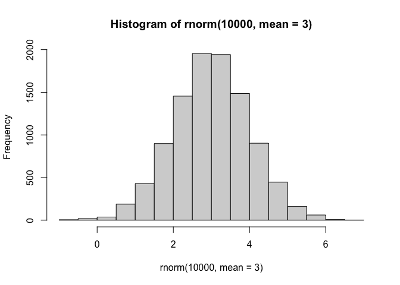

``` r
tmp <- c( rnorm(30,3), rnorm(30, -3))
tmp
```

     [1]  2.185366  3.901221  4.217032  2.876972  2.783218  2.543264  3.410132
     [8]  2.132412  2.547554  2.176099  3.000395  3.375672  2.415444  1.350208
    [15]  3.334038  4.153279  2.599700  3.702871  3.309124  3.056113  4.721412
    [22]  2.118958  5.029392  1.042052  3.216836  5.610370  3.260563  2.695371
    [29]  2.787475  3.279570 -2.472855 -4.168977 -2.419283 -4.449187 -4.007934
    [36] -3.606278 -3.551921 -2.546702 -3.730579 -4.179384 -0.973073 -5.043035
    [43] -4.433307 -3.333712 -4.384609 -1.697361 -2.103902 -4.616193 -3.417184
    [50] -1.145832 -4.501915 -2.992141 -1.293253 -3.844873 -2.721412 -1.141675
    [57] -3.371485 -3.297723 -2.030077 -3.860644

``` r
x <- cbind(x = tmp, y = rev(tmp))
head(x)
```

                x         y
    [1,] 2.185366 -3.860644
    [2,] 3.901221 -2.030077
    [3,] 4.217032 -3.297723
    [4,] 2.876972 -3.371485
    [5,] 2.783218 -1.141675
    [6,] 2.543264 -2.721412

``` r
plot(x)
```

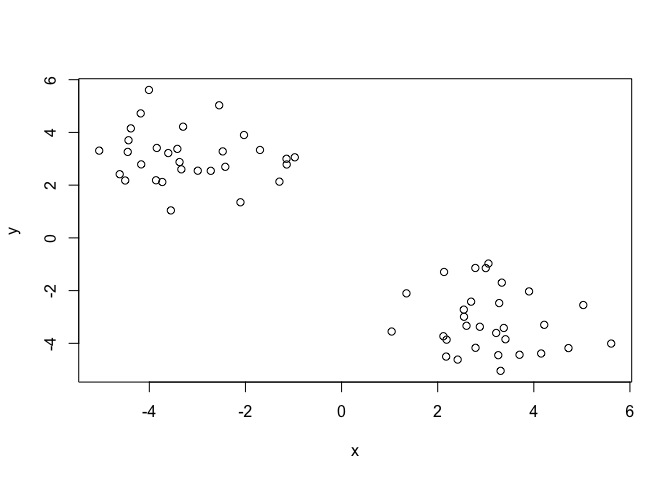

The main function in R for K-means clustering is called `kmeans()`.

``` r
k <- kmeans(x, centers = 2, nstart = 20)
k
```

    K-means clustering with 2 clusters of sizes 30, 30

    Cluster means:
              x         y
    1  3.094404 -3.177884
    2 -3.177884  3.094404

    Clustering vector:
     [1] 1 1 1 1 1 1 1 1 1 1 1 1 1 1 1 1 1 1 1 1 1 1 1 1 1 1 1 1 1 1 2 2 2 2 2 2 2 2
    [39] 2 2 2 2 2 2 2 2 2 2 2 2 2 2 2 2 2 2 2 2 2 2

    Within cluster sum of squares by cluster:
    [1] 68.36231 68.36231
     (between_SS / total_SS =  89.6 %)

    Available components:

    [1] "cluster"      "centers"      "totss"        "withinss"     "tot.withinss"
    [6] "betweenss"    "size"         "iter"         "ifault"      

> Q1. How many points are in each cluster?

``` r
k$size
```

    [1] 30 30

> Q2. The clustering result i.e. membership vector?

``` r
k$cluster
```

     [1] 1 1 1 1 1 1 1 1 1 1 1 1 1 1 1 1 1 1 1 1 1 1 1 1 1 1 1 1 1 1 2 2 2 2 2 2 2 2
    [39] 2 2 2 2 2 2 2 2 2 2 2 2 2 2 2 2 2 2 2 2 2 2

> Q3. Cluster centers

``` r
k$centers
```

              x         y
    1  3.094404 -3.177884
    2 -3.177884  3.094404

> Q4. Make a plot of our data colored by clustering results with
> optionally the cluster centers shown.

``` r
plot(x, col = k$cluster, pch = 16)
points(k$centers, col = "blue", pch = 15, cex = 2)
```

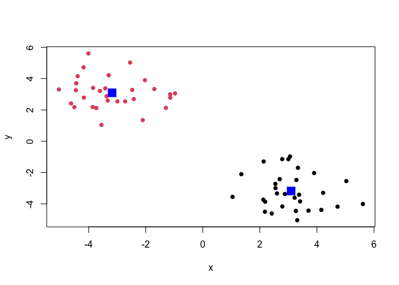

> Q5. Run kmeans again but cluster into 3 groups and plot the results
> like we did above.

``` r
k <- kmeans(x, centers = 3, nstart = 20)
k
```

    K-means clustering with 3 clusters of sizes 19, 11, 30

    Cluster means:
              x         y
    1 -3.936373  3.143522
    2 -1.867766  3.009564
    3  3.094404 -3.177884

    Clustering vector:
     [1] 3 3 3 3 3 3 3 3 3 3 3 3 3 3 3 3 3 3 3 3 3 3 3 3 3 3 3 3 3 3 2 1 2 1 1 1 1 2
    [39] 1 1 2 1 1 1 1 2 2 1 1 2 1 1 2 1 2 2 1 1 2 1

    Within cluster sum of squares by cluster:
    [1] 25.33050 13.09549 68.36231
     (between_SS / total_SS =  91.9 %)

    Available components:

    [1] "cluster"      "centers"      "totss"        "withinss"     "tot.withinss"
    [6] "betweenss"    "size"         "iter"         "ifault"      

``` r
plot(x, col = k$cluster, pch = 16)
points(k$centers, col = "blue", pch = 15, cex = 3)
```

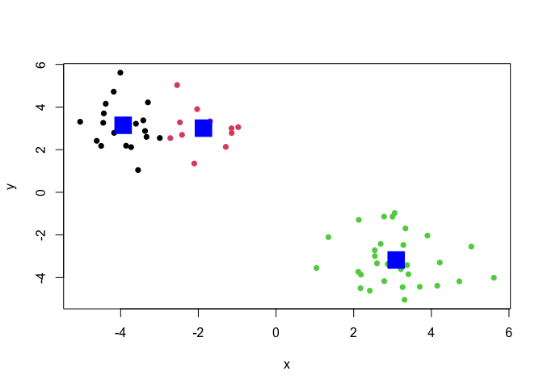

K-means will always return a clustering result - even if there is no
clear groupings.

# Hierarchical Clustering (bottom up)

Hierarchical clustering has an advantage in that it can reveal the
structure in your data rather than imposing a structure as k-means will.

The main function for this in base R is called `hclust()`

It requires a distance matrix as input, not the raw data itself.

                  x         y
     [1,]  2.185366 -3.860644
     [2,]  3.901221 -2.030077
     [3,]  4.217032 -3.297723
     [4,]  2.876972 -3.371485
     [5,]  2.783218 -1.141675
     [6,]  2.543264 -2.721412
     [7,]  3.410132 -3.844873
     [8,]  2.132412 -1.293253
     [9,]  2.547554 -2.992141
    [10,]  2.176099 -4.501915
    [11,]  3.000395 -1.145832
    [12,]  3.375672 -3.417184
    [13,]  2.415444 -4.616193
    [14,]  1.350208 -2.103902
    [15,]  3.334038 -1.697361
    [16,]  4.153279 -4.384609
    [17,]  2.599700 -3.333712
    [18,]  3.702871 -4.433307
    [19,]  3.309124 -5.043035
    [20,]  3.056113 -0.973073
    [21,]  4.721412 -4.179384
    [22,]  2.118958 -3.730579
    [23,]  5.029392 -2.546702
    [24,]  1.042052 -3.551921
    [25,]  3.216836 -3.606278
    [26,]  5.610370 -4.007934
    [27,]  3.260563 -4.449187
    [28,]  2.695371 -2.419283
    [29,]  2.787475 -4.168977
    [30,]  3.279570 -2.472855
    [31,] -2.472855  3.279570
    [32,] -4.168977  2.787475
    [33,] -2.419283  2.695371
    [34,] -4.449187  3.260563
    [35,] -4.007934  5.610370
    [36,] -3.606278  3.216836
    [37,] -3.551921  1.042052
    [38,] -2.546702  5.029392
    [39,] -3.730579  2.118958
    [40,] -4.179384  4.721412
    [41,] -0.973073  3.056113
    [42,] -5.043035  3.309124
    [43,] -4.433307  3.702871
    [44,] -3.333712  2.599700
    [45,] -4.384609  4.153279
    [46,] -1.697361  3.334038
    [47,] -2.103902  1.350208
    [48,] -4.616193  2.415444
    [49,] -3.417184  3.375672
    [50,] -1.145832  3.000395
    [51,] -4.501915  2.176099
    [52,] -2.992141  2.547554
    [53,] -1.293253  2.132412
    [54,] -3.844873  3.410132
    [55,] -2.721412  2.543264
    [56,] -1.141675  2.783218
    [57,] -3.371485  2.876972
    [58,] -3.297723  4.217032
    [59,] -2.030077  3.901221
    [60,] -3.860644  2.185366

                1          2          3          4          5          6          7
    2   2.5090102                                                                  
    3   2.1082084  1.3063936                                                       
    4   0.8471093  1.6877389  1.3420882                                            
    5   2.7839214  1.4280015  2.5892791  2.2317803                                 
    6   1.1941266  1.5238085  1.7702069  0.7307224  1.5978576                      
    7   1.2248673  1.8800672  0.9749148  0.7129909  2.7749415  1.4190221           
    8   2.5679367  1.9161407  2.8919788  2.2075819  0.6682252  1.4860817  2.8536526
    9   0.9409975  1.6607172  1.6972135  0.5024114  1.8654127  0.2707631  1.2129265
    10  0.6413387  3.0143044  2.3697010  1.3300734  3.4146464  1.8179661  1.3980494
    11  2.8345147  1.2622900  2.4720115  2.2290725  0.2172166  1.6405555  2.7299643
    12  1.2702298  1.4833303  0.8497980  0.5007897  2.3513707  1.0848970  0.4290746
    13  0.7898040  2.9825373  2.2325049  1.3275184  3.4939280  1.8990867  1.2587052
    14  1.9451556  2.5520815  3.1054610  1.9843827  1.7260942  1.3433920  2.6970850
    15  2.4493342  0.6575684  1.8277957  1.7353963  0.7824255  1.2938334  2.1488594
    16  2.0364722  2.3679851  1.0887533  1.6295335  3.5204667  2.3148153  0.9184671
    17  0.6703203  1.8421242  1.6177318  0.2798328  2.1997059  0.6148950  0.9581678
    18  1.6219630  2.4114022  1.2465602  1.3452050  3.4176903  2.0676734  0.6572301
    19  1.6312205  3.0705853  1.9673350  1.7265092  3.9366465  2.4446824  1.2024120
    20  3.0160014  1.3533157  2.5984091  2.4050928  0.3207778  1.8220058  2.8935381
    21  2.5559975  2.3004861  1.0157390  2.0136189  3.6033699  2.6210706  1.3532749
    22  0.1460371  2.4633651  2.1422592  0.8387686  2.6727637  1.0947385  1.2962225
    23  3.1328782  1.2408353  1.1063286  2.3050338  2.6494150  2.4922596  2.0753916
    24  1.1842626  3.2389593  3.1851392  1.8437701  2.9733728  1.7156287  2.3861319
    25  1.0623710  1.7183694  1.0467074  0.4130809  2.5024578  1.1120645  0.3070677
    26  3.4281695  2.6140218  1.5639027  2.8065164  4.0259446  3.3260004  2.2062721
    27  1.2257368  2.5025063  1.4968971  1.1439335  3.3417803  1.8707547  0.6225487
    28  1.5289290  1.2671055  1.7570168  0.9693641  1.2806252  0.3382580  1.5947378
    29  0.6764643  2.4114986  1.6741314  0.8024982  3.0273053  1.4680199  0.7019587
    30  1.7672689  0.7632185  1.2486963  0.9846936  1.4207059  0.7771277  1.3782161
    31  8.5253547  8.2958537  9.3816504  8.5356414  6.8683118  7.8213320  9.2394382
    32  9.1964753  9.3987710 10.3612149  9.3583214  7.9856893  8.6834334 10.0712923
    33  8.0114995  7.8916810  8.9419155  8.0533880  6.4644366  7.3463199  8.7610999
    34  9.7328763  9.8853518 10.8680477  9.8821385  8.4668401  9.2020866 10.5950985
    35 11.3162304 10.9968703 12.1245282 11.3170512  9.5765263 10.5989053 12.0178751
    36  9.1451556  9.1592926 10.1805532  9.2432954  7.7344866  8.5486647  9.9547853
    37  7.5467136  8.0614698  8.8988914  7.7980745  6.7009437  7.1634446  8.5060104
    38 10.0710083  9.5609524 10.7279516  9.9995487  8.1541472  9.2726871 10.6881454
    39  8.4115426  8.6867060  9.6179495  8.5909659  7.2843175  7.9240327  9.3036034
    40 10.6846493 10.5298993 11.6106128 10.7371850  9.1023963 10.0294383 11.4447365
    41  7.6037667  7.0447194  8.2041713  7.4924540  5.6330408  6.7634629  8.1753347
    42 10.1811272 10.4166585 11.3753795 10.3613243  9.0033240  9.6911969 11.0741005
    43 10.0505520 10.1158812 11.1281932 10.1728410  8.6918274  9.4838792 10.8852184
    44  8.4968386  8.5894753  9.5808835  8.6155466  7.1704058  7.9279936  9.3280197
    45 10.3627952 10.3387067 11.3800548 10.4571803  8.9114687  9.7599589 11.1681875
    46  8.1755131  7.7535699  8.8859607  8.1171767  6.3330557  7.3926571  8.8104055
    47  6.7491330  6.8911412  7.8458566  6.8631980  5.4857473  6.1785308  7.5758455
    48  9.2547547  9.6077569 10.5197973  9.4676324  8.2100168  8.8116466 10.1790697
    49  9.1516575  9.0984159 10.1397955  9.2271624  7.6714672  8.5265103  9.9372286
    50  7.6269740  7.1258956  8.2720372  7.5355029  5.7091310  6.8079738  8.2228036
    51  9.0089957  9.3970536 10.2947933  9.2316666  8.0050481  8.5802198  9.9424645
    52  8.2384216  8.2748506  9.2811340  8.3355575  6.8531154  7.6421675  9.0472224
    53  6.9294664  6.6564907  7.7362524  6.9053351  5.2285044  6.1869597  7.6059030
    54  9.4460555  9.4656135 10.4875939  9.5484828  8.0405556  8.8546105 10.2601263
    55  8.0676210  8.0482741  9.0696822  8.1440874  6.6241777  7.4453766  8.8546105
    56  7.4303500  6.9712699  8.1051577  7.3505027  5.5506367  6.6241777  8.0405556
    57  8.7335020  8.7733332  9.7832736  8.8366523  7.3505027  8.1440874  9.5484828
    58  9.7628432  9.5315874 10.6274682  9.7832736  8.1051577  9.0696822 10.4875939
    59  8.8326950  8.3881215  9.5315874  8.7733332  6.9712699  8.0482741  9.4656135
    60  8.5503493  8.8326950  9.7628432  8.7335020  7.4303500  8.0676210  9.4460555
                8          9         10         11         12         13         14
    2                                                                              
    3                                                                              
    4                                                                              
    5                                                                              
    6                                                                              
    7                                                                              
    8                                                                              
    9   1.7488756                                                                  
    10  3.2089598  1.5547978                                                       
    11  0.8804135  1.9010321  3.4558297                                            
    12  2.4610525  0.9308275  1.6172868  2.3021453                                 
    13  3.3349717  1.6294157  0.2652269  3.5193140  1.5361182                      
    14  1.1264971  1.4908415  2.5362500  1.9081450  2.4139626  2.7287969           
    15  1.2677575  1.5149299  3.0341963  0.6445944  1.7203269  3.0599662  2.0250578
    16  3.6932890  2.1253977  1.9806565  3.4378503  1.2412021  1.7531973  3.6137003
    17  2.0932824  0.3455279  1.2426330  2.2242696  0.7804486  1.2956493  1.7531866
    18  3.5108809  1.8470830  1.5283124  3.3616911  1.0675045  1.3003517  3.3107632
    19  3.9300782  2.1877274  1.2556096  3.9094120  1.6272119  0.9903827  3.5321174
    20  0.9776196  2.0821310  3.6369154  0.1815219  2.4649131  3.6990240  2.0466778
    21  3.8771996  2.4769340  2.5656662  3.4877412  1.5465980  2.3469745  3.9588692
    22  2.4373631  0.8538059  0.7734501  2.7309059  1.2952009  0.9339248  1.7991817
    23  3.1565219  2.5214946  3.4589218  2.4656169  1.8688311  3.3339940  3.7057350
    24  2.5080799  1.6062039  1.4793760  3.1023170  2.3375065  1.7374929  1.4804449
    25  2.5546160  0.9083514  1.3730621  2.4699479  0.2469521  1.2892466  2.3961295
    26  4.4119936  3.2268676  3.4696160  3.8734477  2.3114631  3.2523117  4.6662964
    27  3.3515139  1.6221476  1.0857446  3.3135845  1.0384027  0.8614617  3.0248666
    28  1.2589152  0.5916216  2.1463921  1.3094724  1.2077316  2.2146714  1.3816402
    29  2.9493892  1.2010427  0.6961521  3.0306338  0.9545516  0.5817289  2.5160029
    30  1.6454277  0.8974994  2.3097044  1.3560708  0.9492068  2.3109761  1.9643231
    31  6.4899297  8.0336089  9.0644519  7.0385115  8.8911067  9.2864705  6.6028462
    32  7.5073190  8.8609118  9.6641193  8.1774566  9.7682915  9.9080217  7.3747520
    33  6.0520284  7.5509784  8.5392313  6.6428723  8.4228757  8.7654751  6.1026293
    34  8.0034168  9.3835336 10.2054146  8.6552058 10.2869200 10.4482746  7.9000294
    35  9.2392562 10.8156199 11.8532943  9.7346258 11.6625199 12.0765217  9.3925332
    36  7.2988676  8.7419142  9.6444295  7.9171337  9.6310881  9.8801563  7.2716581
    37  6.1453465  7.3128868  7.9715611  6.9079430  8.2387090  8.2234529  5.8247652
    38  7.8657452  9.5024445 10.6372307  8.3008240 10.3159665 10.8471289  8.1283329
    39  6.7836455  8.0955730  8.8727007  7.4809669  9.0082005  9.1178869  6.6065834
    40  8.7186560 10.2347747 11.2009794  9.2722048 11.1047567 11.4316502  8.7841506
    41  5.3442514  6.9983002  8.1878621  5.7831473  7.7984078  8.3872720  5.6589218
    42  8.5246059  9.8652416 10.6361758  9.1947482 10.7757990 10.8829939  8.3770163
    43  8.2504498  9.6724157 10.5357855  8.8752381 10.5676555 10.7755380  8.1955879
    44  6.7107072  8.1152934  8.9883793  7.3586630  9.0121434  9.2261534  6.6379950
    45  8.4933069  9.9554968 10.8607217  9.0894914 10.8413036 11.0970425  8.4876636
    46  6.0065781  7.6183892  8.7410446  6.4913902  8.4448010  8.9510522  6.2336882
    47  4.9934197  6.3633360  7.2502246  5.6819067  7.2631782  7.4848130  4.8848490
    48  7.7005257  8.9755923  9.6945911  8.4080376  9.8939100  9.9442364  7.4848130
    49  7.2523702  8.7250877  9.6613251  7.8504343  9.6065492  9.8939100  7.2631782
    50  5.4020639  7.0392895  8.2048698  5.8636504  7.8504343  8.4080376  5.6819067
    51  7.4867016  8.7410376  9.4441390  8.2048698  9.6613251  9.6945911  7.2502246
    52  6.4041273  7.8343132  8.7410376  7.0392895  8.7250877  8.9755923  6.3633360
    53  4.8446214  6.4041273  7.4867016  5.4020639  7.2523702  7.7005257  4.9934197
    54  7.6059030  9.0472224  9.9424645  8.2228036  9.9372286 10.1790697  7.5758455
    55  6.1869597  7.6421675  8.5802198  6.8079738  8.5265103  8.8116466  6.1785308
    56  5.2285044  6.8531154  8.0050481  5.7091310  7.6714672  8.2100168  5.4857473
    57  6.9053351  8.3355575  9.2316666  7.5355029  9.2271624  9.4676324  6.8631980
    58  7.7362524  9.2811340 10.2947933  8.2720372 10.1397955 10.5197973  7.8458566
    59  6.6564907  8.2748506  9.3970536  7.1258956  9.0984159  9.6077569  6.8911412
    60  6.9294664  8.2384216  9.0089957  7.6269740  9.1516575  9.2547547  6.7491330
               15         16         17         18         19         20         21
    2                                                                              
    3                                                                              
    4                                                                              
    5                                                                              
    6                                                                              
    7                                                                              
    8                                                                              
    9                                                                              
    10                                                                             
    11                                                                             
    12                                                                             
    13                                                                             
    14                                                                             
    15                                                                             
    16  2.8093513                                                                  
    17  1.7935709  1.8756308                                                       
    18  2.7606956  0.4530330  1.5575931                                            
    19  3.3457663  1.0705709  1.8506935  0.7258125                                 
    20  0.7757804  3.5836220  2.4043564  3.5201587  4.0778183                      
    21  2.8434567  0.6040631  2.2840367  1.0497157  1.6554301  3.6129837           
    22  2.3686269  2.1368703  0.6233906  1.7328030  1.7717321  2.9124042  2.6408694
    23  1.8962084  2.0360440  2.5539751  2.3062825  3.0316660  2.5239131  1.6614762
    24  2.9483202  3.2207302  1.5728582  2.8029985  2.7134918  3.2721399  3.7324793
    25  1.9125117  1.2176710  0.6746478  0.9592741  1.4397173  2.6381057  1.6100305
    26  3.2435220  1.5049914  3.0852407  1.9543532  2.5233247  3.9666872  0.9053408
    27  2.7528068  0.8950489  1.2965432  0.4425931  0.5958298  3.4821213  1.4855551
    28  0.9638815  2.4470388  0.9194197  2.2519657  2.6945805  1.4905233  2.6838029
    29  2.5313272  1.3827213  0.8561116  0.9527964  1.0178875  3.2071747  1.9339654
    30  0.7774042  2.1019443  1.0969495  2.0056317  2.5703498  1.5163371  2.2340885
    31  7.6478654 10.1314006  8.3346451  9.8806915 10.1339542  6.9752750 10.3630821
    32  8.7412233 10.9862970  9.1260022 10.6820263 10.8276902  8.1451612 11.2949609
    33  7.2385634  9.6604701  7.8447456  9.3967456  9.6279579  6.5907094  9.9122040
    34  9.2281960 11.5087387  9.6525266 11.2094464 11.3640277  8.6170301 11.8090093
    35 10.3589326 12.9036814 11.1201363 12.6622261 12.9241778  9.6562150 13.1164313
    36  8.5039594 10.8624442  9.0235165 10.5805653 10.7725698  7.8703751 11.1379758
    37  7.4108576  9.4243698  7.5491554  9.0890903  9.1707260  6.9084618  9.7832219
    38  8.9348930 11.5547893  9.8197233 11.3401873 11.6509435  8.2110371 11.7314554
    39  8.0295147 10.2201565  8.3548816  9.9090043 10.0424880  7.4578718 10.5406486
    40  9.8819108 12.3431311 10.5281055 12.0805147 12.3053719  9.2075831 12.5876268
    41  6.4145713  9.0356974  7.3208317  8.8292625  9.1615180  5.6981301  9.2075831
    42  9.7591106 11.9902338 10.1261378 11.6805870 11.8117363  9.1615180 12.3053719
    43  9.4601353 11.7956259  9.9487031 11.5062938 11.6805870  8.8292625 12.0805147
    44  7.9324412 10.2389257  8.3911117  9.9487031 10.1261378  7.3208317 10.5281055
    45  9.6854268 12.0743963 10.2389257 11.7956259 11.9902338  9.0356974 12.3431311
    46  7.1154727  9.6854268  7.9324412  9.4601353  9.7591106  6.4145713  9.8819108
    47  6.2336882  8.4876636  6.6379950  8.1955879  8.3770163  5.6589218  8.7841506
    48  8.9510522 11.0970425  9.2261534 10.7755380 10.8829939  8.3872720 11.4316502
    49  8.4448010 10.8413036  9.0121434 10.5676555 10.7757990  7.7984078 11.1047567
    50  6.4913902  9.0894914  7.3586630  8.8752381  9.1947482  5.7831473  9.2722048
    51  8.7410446 10.8607217  8.9883793 10.5357855 10.6361758  8.1878621 11.2009794
    52  7.6183892  9.9554968  8.1152934  9.6724157  9.8652416  6.9983002 10.2347747
    53  6.0065781  8.4933069  6.7107072  8.2504498  8.5246059  5.3442514  8.7186560
    54  8.8104055 11.1681875  9.3280197 10.8852184 11.0741005  8.1753347 11.4447365
    55  7.3926571  9.7599589  7.9279936  9.4838792  9.6911969  6.7634629 10.0294383
    56  6.3330557  8.9114687  7.1704058  8.6918274  9.0033240  5.6330408  9.1023963
    57  8.1171767 10.4571803  8.6155466 10.1728410 10.3613243  7.4924540 10.7371850
    58  8.8859607 11.3800548  9.5808835 11.1281932 11.3753795  8.2041713 11.6106128
    59  7.7535699 10.3387067  8.5894753 10.1158812 10.4166585  7.0447194 10.5298993
    60  8.1755131 10.3627952  8.4968386 10.0505520 10.1811272  7.6037667 10.6846493
               22         23         24         25         26         27         28
    2                                                                              
    3                                                                              
    4                                                                              
    5                                                                              
    6                                                                              
    7                                                                              
    8                                                                              
    9                                                                              
    10                                                                             
    11                                                                             
    12                                                                             
    13                                                                             
    14                                                                             
    15                                                                             
    16                                                                             
    17                                                                             
    18                                                                             
    19                                                                             
    20                                                                             
    21                                                                             
    22                                                                             
    23  3.1420041                                                                  
    24  1.0916256  4.1120978                                                       
    25  1.1048922  2.0995381  2.1754638                                            
    26  3.5024110  1.5724928  4.5910218  2.4270005                                 
    27  1.3489471  2.5977311  2.3930896  0.8440422  2.3908784                      
    28  1.4323922  2.3374968  2.0040786  1.2964888  3.3197939  2.1071191           
    29  0.7994416  2.7673039  1.8512858  0.7078005  2.8274856  0.5498455  1.7521162
    30  1.7113998  1.7513799  2.4841236  1.1351583  2.7908955  1.9764237  0.5866502
    31  8.3801513  9.4989028  7.6826970  8.9323844 10.8833008  9.6231887  7.6933403
    32  9.0566636 10.6331293  8.2062632  9.7688442 11.9085351 10.3714674  8.6156602
    33  7.8669225  9.1083531  7.1420931  8.4543851 10.4599058  9.1271770  7.2332134
    34  9.5925283 11.1161050  8.7500650 10.2918134 12.4107105 10.9032329  9.1271770
    35 11.1710402 12.1741976 10.4618321 11.7108460 13.6023359 12.4107105 10.4599058
    36  9.0024949 10.3823494  8.2111538  9.6493413 11.7108460 10.2918134  8.4543851
    37  7.4119414  9.3015099  6.4968584  8.2111538 10.4618321  8.7500650  7.1420931
    38  9.9249928 10.7142152  9.3015099 10.3823494 12.1741976 11.1161050  9.1083531
    39  8.2724951  9.9249928  7.4119414  9.0024949 11.1710402  9.5925283  7.8669225
    40 10.5406486 11.7314554  9.7832219 11.1379758 13.1164313 11.8090093  9.9122040
    41  7.4578718  8.2110371  6.9084618  7.8703751  9.6562150  8.6170301  6.5907094
    42 10.0424880 11.6509435  9.1707260 10.7725698 12.9241778 11.3640277  9.6279579
    43  9.9090043 11.3401873  9.0890903 10.5805653 12.6622261 11.2094464  9.3967456
    44  8.3548816  9.8197233  7.5491554  9.0235165 11.1201363  9.6525266  7.8447456
    45 10.2201565 11.5547893  9.4243698 10.8624442 12.9036814 11.5087387  9.6604701
    46  8.0295147  8.9348930  7.4108576  8.5039594 10.3589326  9.2281960  7.2385634
    47  6.6065834  8.1283329  5.8247652  7.2716581  9.3925332  7.9000294  6.1026293
    48  9.1178869 10.8471289  8.2234529  9.8801563 12.0765217 10.4482746  8.7654751
    49  9.0082005 10.3159665  8.2387090  9.6310881 11.6625199 10.2869200  8.4228757
    50  7.4809669  8.3008240  6.9079430  7.9171337  9.7346258  8.6552058  6.6428723
    51  8.8727007 10.6372307  7.9715611  9.6444295 11.8532943 10.2054146  8.5392313
    52  8.0955730  9.5024445  7.3128868  8.7419142 10.8156199  9.3835336  7.5509784
    53  6.7836455  7.8657452  6.1453465  7.2988676  9.2392562  8.0034168  6.0520284
    54  9.3036034 10.6881454  8.5060104  9.9547853 12.0178751 10.5950985  8.7610999
    55  7.9240327  9.2726871  7.1634446  8.5486647 10.5989053  9.2020866  7.3463199
    56  7.2843175  8.1541472  6.7009437  7.7344866  9.5765263  8.4668401  6.4644366
    57  8.5909659  9.9995487  7.7980745  9.2432954 11.3170512  9.8821385  8.0533880
    58  9.6179495 10.7279516  8.8988914 10.1805532 12.1245282 10.8680477  8.9419155
    59  8.6867060  9.5609524  8.0614698  9.1592926 10.9968703  9.8853518  7.8916810
    60  8.4115426 10.0710083  7.5467136  9.1451556 11.3162304  9.7328763  8.0114995
               29         30         31         32         33         34         35
    2                                                                              
    3                                                                              
    4                                                                              
    5                                                                              
    6                                                                              
    7                                                                              
    8                                                                              
    9                                                                              
    10                                                                             
    11                                                                             
    12                                                                             
    13                                                                             
    14                                                                             
    15                                                                             
    16                                                                             
    17                                                                             
    18                                                                             
    19                                                                             
    20                                                                             
    21                                                                             
    22                                                                             
    23                                                                             
    24                                                                             
    25                                                                             
    26                                                                             
    27                                                                             
    28                                                                             
    29                                                                             
    30  1.7660658                                                                  
    31  9.1187673  8.1351570                                                       
    32  9.8379084  9.1187673  1.7660658                                            
    33  8.6156602  7.6933403  0.5866502  1.7521162                                 
    34 10.3714674  9.6231887  1.9764237  0.5498455  2.1071191                      
    35 11.9085351 10.8833008  2.7908955  2.8274856  3.3197939  2.3908784           
    36  9.7688442  8.9323844  1.1351583  0.7078005  1.2964888  0.8440422  2.4270005
    37  8.2062632  7.6826970  2.4841236  1.8512858  2.0040786  2.3930896  4.5910218
    38 10.6331293  9.4989028  1.7513799  2.7673039  2.3374968  2.5977311  1.5724928
    39  9.0566636  8.3801513  1.7113998  0.7994416  1.4323922  1.3489471  3.5024110
    40 11.2949609 10.3630821  2.2340885  1.9339654  2.6838029  1.4855551  0.9053408
    41  8.1451612  6.9752750  1.5163371  3.2071747  1.4905233  3.4821213  3.9666872
    42 10.8276902 10.1339542  2.5703498  1.0178875  2.6945805  0.5958298  2.5233247
    43 10.6820263  9.8806915  2.0056317  0.9527964  2.2519657  0.4425931  1.9543532
    44  9.1260022  8.3346451  1.0969495  0.8561116  0.9194197  1.2965432  3.0852407
    45 10.9862970 10.1314006  2.1019443  1.3827213  2.4470388  0.8950489  1.5049914
    46  8.7412233  7.6478654  0.7774042  2.5313272  0.9638815  2.7528068  3.2435220
    47  7.3747520  6.6028462  1.9643231  2.5160029  1.3816402  3.0248666  4.6662964
    48  9.9080217  9.2864705  2.3109761  0.5817289  2.2146714  0.8614617  3.2523117
    49  9.7682915  8.8911067  0.9492068  0.9545516  1.2077316  1.0384027  2.3114631
    50  8.1774566  7.0385115  1.3560708  3.0306338  1.3094724  3.3135845  3.8734477
    51  9.6641193  9.0644519  2.3097044  0.6961521  2.1463921  1.0857446  3.4696160
    52  8.8609118  8.0336089  0.8974994  1.2010427  0.5916216  1.6221476  3.2268676
    53  7.5073190  6.4899297  1.6454277  2.9493892  1.2589152  3.3515139  4.4119936
    54 10.0712923  9.2394382  1.3782161  0.7019587  1.5947378  0.6225487  2.2062721
    55  8.6834334  7.8213320  0.7771277  1.4680199  0.3382580  1.8707547  3.3260004
    56  7.9856893  6.8683118  1.4207059  3.0273053  1.2806252  3.3417803  4.0259446
    57  9.3583214  8.5356414  0.9846936  0.8024982  0.9693641  1.1439335  2.8065164
    58 10.3612149  9.3816504  1.2486963  1.6741314  1.7570168  1.4968971  1.5639027
    59  9.3987710  8.2958537  0.7632185  2.4114986  1.2671055  2.5025063  2.6140218
    60  9.1964753  8.5253547  1.7672689  0.6764643  1.5289290  1.2257368  3.4281695
               36         37         38         39         40         41         42
    2                                                                              
    3                                                                              
    4                                                                              
    5                                                                              
    6                                                                              
    7                                                                              
    8                                                                              
    9                                                                              
    10                                                                             
    11                                                                             
    12                                                                             
    13                                                                             
    14                                                                             
    15                                                                             
    16                                                                             
    17                                                                             
    18                                                                             
    19                                                                             
    20                                                                             
    21                                                                             
    22                                                                             
    23                                                                             
    24                                                                             
    25                                                                             
    26                                                                             
    27                                                                             
    28                                                                             
    29                                                                             
    30                                                                             
    31                                                                             
    32                                                                             
    33                                                                             
    34                                                                             
    35                                                                             
    36                                                                             
    37  2.1754638                                                                  
    38  2.0995381  4.1120978                                                       
    39  1.1048922  1.0916256  3.1420041                                            
    40  1.6100305  3.7324793  1.6614762  2.6408694                                 
    41  2.6381057  3.2721399  2.5239131  2.9124042  3.6129837                      
    42  1.4397173  2.7134918  3.0316660  1.7717321  1.6554301  4.0778183           
    43  0.9592741  2.8029985  2.3062825  1.7328030  1.0497157  3.5201587  0.7258125
    44  0.6746478  1.5728582  2.5539751  0.6233906  2.2840367  2.4043564  1.8506935
    45  1.2176710  3.2207302  2.0360440  2.1368703  0.6040631  3.5836220  1.0705709
    46  1.9125117  2.9483202  1.8962084  2.3686269  2.8434567  0.7757804  3.3457663
    47  2.3961295  1.4804449  3.7057350  1.7991817  3.9588692  2.0466778  3.5321174
    48  1.2892466  1.7374929  3.3339940  0.9339248  2.3469745  3.6990240  0.9903827
    49  0.2469521  2.3375065  1.8688311  1.2952009  1.5465980  2.4649131  1.6272119
    50  2.4699479  3.1023170  2.4656169  2.7309059  3.4877412  0.1815219  3.9094120
    51  1.3730621  1.4793760  3.4589218  0.7734501  2.5656662  3.6369154  1.2556096
    52  0.9083514  1.6062039  2.5214946  0.8538059  2.4769340  2.0821310  2.1877274
    53  2.5546160  2.5080799  3.1565219  2.4373631  3.8771996  0.9776196  3.9300782
    54  0.3070677  2.3861319  2.0753916  1.2962225  1.3532749  2.8935381  1.2024120
    55  1.1120645  1.7156287  2.4922596  1.0947385  2.6210706  1.8220058  2.4446824
    56  2.5024578  2.9733728  2.6494150  2.6727637  3.6033699  0.3207778  3.9366465
    57  0.4130809  1.8437701  2.3050338  0.8387686  2.0136189  2.4050928  1.7265092
    58  1.0467074  3.1851392  1.1063286  2.1422592  1.0157390  2.5984091  1.9673350
    59  1.7183694  3.2389593  1.2408353  2.4633651  2.3004861  1.3533157  3.0705853
    60  1.0623710  1.1842626  3.1328782  0.1460371  2.5559975  3.0160014  1.6312205
               43         44         45         46         47         48         49
    2                                                                              
    3                                                                              
    4                                                                              
    5                                                                              
    6                                                                              
    7                                                                              
    8                                                                              
    9                                                                              
    10                                                                             
    11                                                                             
    12                                                                             
    13                                                                             
    14                                                                             
    15                                                                             
    16                                                                             
    17                                                                             
    18                                                                             
    19                                                                             
    20                                                                             
    21                                                                             
    22                                                                             
    23                                                                             
    24                                                                             
    25                                                                             
    26                                                                             
    27                                                                             
    28                                                                             
    29                                                                             
    30                                                                             
    31                                                                             
    32                                                                             
    33                                                                             
    34                                                                             
    35                                                                             
    36                                                                             
    37                                                                             
    38                                                                             
    39                                                                             
    40                                                                             
    41                                                                             
    42                                                                             
    43                                                                             
    44  1.5575931                                                                  
    45  0.4530330  1.8756308                                                       
    46  2.7606956  1.7935709  2.8093513                                            
    47  3.3107632  1.7531866  3.6137003  2.0250578                                 
    48  1.3003517  1.2956493  1.7531973  3.0599662  2.7287969                      
    49  1.0675045  0.7804486  1.2412021  1.7203269  2.4139626  1.5361182           
    50  3.3616911  2.2242696  3.4378503  0.6445944  1.9081450  3.5193140  2.3021453
    51  1.5283124  1.2426330  1.9806565  3.0341963  2.5362500  0.2652269  1.6172868
    52  1.8470830  0.3455279  2.1253977  1.5149299  1.4908415  1.6294157  0.9308275
    53  3.5108809  2.0932824  3.6932890  1.2677575  1.1264971  3.3349717  2.4610525
    54  0.6572301  0.9581678  0.9184671  2.1488594  2.6970850  1.2587052  0.4290746
    55  2.0676734  0.6148950  2.3148153  1.2938334  1.3433920  1.8990867  1.0848970
    56  3.4176903  2.1997059  3.5204667  0.7824255  1.7260942  3.4939280  2.3513707
    57  1.3452050  0.2798328  1.6295335  1.7353963  1.9843827  1.3275184  0.5007897
    58  1.2465602  1.6177318  1.0887533  1.8277957  3.1054610  2.2325049  0.8497980
    59  2.4114022  1.8421242  2.3679851  0.6575684  2.5520815  2.9825373  1.4833303
    60  1.6219630  0.6703203  2.0364722  2.4493342  1.9451556  0.7898040  1.2702298
               50         51         52         53         54         55         56
    2                                                                              
    3                                                                              
    4                                                                              
    5                                                                              
    6                                                                              
    7                                                                              
    8                                                                              
    9                                                                              
    10                                                                             
    11                                                                             
    12                                                                             
    13                                                                             
    14                                                                             
    15                                                                             
    16                                                                             
    17                                                                             
    18                                                                             
    19                                                                             
    20                                                                             
    21                                                                             
    22                                                                             
    23                                                                             
    24                                                                             
    25                                                                             
    26                                                                             
    27                                                                             
    28                                                                             
    29                                                                             
    30                                                                             
    31                                                                             
    32                                                                             
    33                                                                             
    34                                                                             
    35                                                                             
    36                                                                             
    37                                                                             
    38                                                                             
    39                                                                             
    40                                                                             
    41                                                                             
    42                                                                             
    43                                                                             
    44                                                                             
    45                                                                             
    46                                                                             
    47                                                                             
    48                                                                             
    49                                                                             
    50                                                                             
    51  3.4558297                                                                  
    52  1.9010321  1.5547978                                                       
    53  0.8804135  3.2089598  1.7488756                                            
    54  2.7299643  1.3980494  1.2129265  2.8536526                                 
    55  1.6405555  1.8179661  0.2707631  1.4860817  1.4190221                      
    56  0.2172166  3.4146464  1.8654127  0.6682252  2.7749415  1.5978576           
    57  2.2290725  1.3300734  0.5024114  2.2075819  0.7129909  0.7307224  2.2317803
    58  2.4720115  2.3697010  1.6972135  2.8919788  0.9749148  1.7702069  2.5892791
    59  1.2622900  3.0143044  1.6607172  1.9161407  1.8800672  1.5238085  1.4280015
    60  2.8345147  0.6413387  0.9409975  2.5679367  1.2248673  1.1941266  2.7839214
               57         58         59
    2                                  
    3                                  
    4                                  
    5                                  
    6                                  
    7                                  
    8                                  
    9                                  
    10                                 
    11                                 
    12                                 
    13                                 
    14                                 
    15                                 
    16                                 
    17                                 
    18                                 
    19                                 
    20                                 
    21                                 
    22                                 
    23                                 
    24                                 
    25                                 
    26                                 
    27                                 
    28                                 
    29                                 
    30                                 
    31                                 
    32                                 
    33                                 
    34                                 
    35                                 
    36                                 
    37                                 
    38                                 
    39                                 
    40                                 
    41                                 
    42                                 
    43                                 
    44                                 
    45                                 
    46                                 
    47                                 
    48                                 
    49                                 
    50                                 
    51                                 
    52                                 
    53                                 
    54                                 
    55                                 
    56                                 
    57                                 
    58  1.3420882                      
    59  1.6877389  1.3063936           
    60  0.8471093  2.1082084  2.5090102

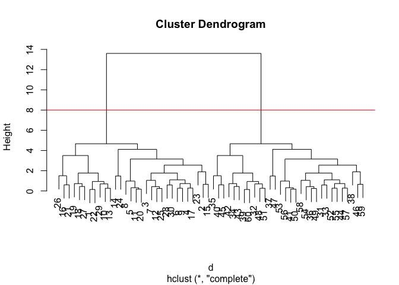

The function to get our clusters/groups from a hclust object is called
`cutree()`

``` r
groups <- cutree(hc, h = 8)
groups
```

     [1] 1 1 1 1 1 1 1 1 1 1 1 1 1 1 1 1 1 1 1 1 1 1 1 1 1 1 1 1 1 1 2 2 2 2 2 2 2 2
    [39] 2 2 2 2 2 2 2 2 2 2 2 2 2 2 2 2 2 2 2 2 2 2

We can now see the 2 clusters in the original matrix ‘x’ and that there
is instric hierarchy within.

> Q6. Plot our hclust results in terms of our data colored by cluster
> membership

``` r
plot(x, col = groups)
```

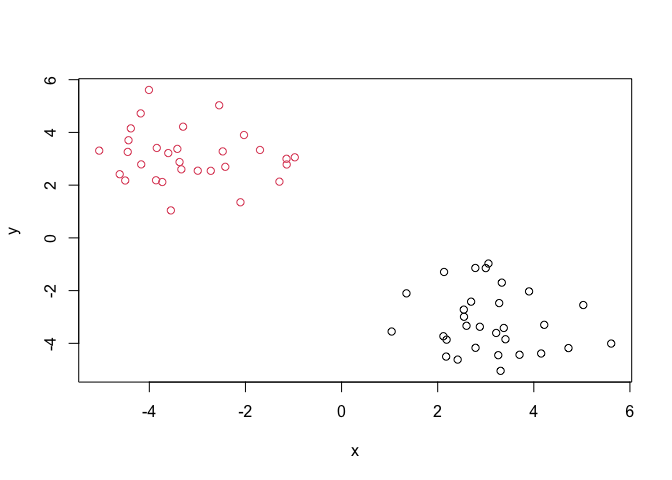

# PCA of UK Food Data

``` r
#Importing UK Food Data
url <- "https://tinyurl.com/UK-foods" 
uk_food_data <- read.csv(url)
```

> Q1: How many rows and columns are in your new data frame named x? What
> R functions could you use to answer this questions?

## Observing dimensions and first 6 rows

``` r
dim(uk_food_data)
```

    [1] 17  5

``` r
head(uk_food_data)
```

                   X England Wales Scotland N.Ireland
    1         Cheese     105   103      103        66
    2  Carcass_meat      245   227      242       267
    3    Other_meat      685   803      750       586
    4           Fish     147   160      122        93
    5 Fats_and_oils      193   235      184       209
    6         Sugars     156   175      147       139

Assigning row names the wrong way…

``` r
rownames(x) <- x[,1]
x <- x[,-1]
head(x)
```

    2.18536638324563  3.9012209606382 4.21703151672494 2.87697179074815 
           -3.860644        -2.030077        -3.297723        -3.371485 
    2.78321812193073 2.54326391021796 
           -1.141675        -2.721412 

## Assigning it the right way…

``` r
x <- read.csv(url, row.names=1) #rownames = first column of df
head(x)
```

                   England Wales Scotland N.Ireland
    Cheese             105   103      103        66
    Carcass_meat       245   227      242       267
    Other_meat         685   803      750       586
    Fish               147   160      122        93
    Fats_and_oils      193   235      184       209
    Sugars             156   175      147       139

> Q2: Which approach to solving the ‘row-names problem’ mentioned above
> do you prefer and why? Is one approach more robust than another under
> certain circumstances?

Second one, since it does not iteratively remove columns and also
assigns the row names correctly as you are importing the dataset into R.

## Spotting Major Differences and Trends in Dataset

``` r
barplot(as.matrix(x), beside=T, col=rainbow(nrow(x)))
```


> Q3: Changing what optional argument in the above barplot() function
> results in the following plot?

``` r
barplot(as.matrix(x), beside=F, col=rainbow(nrow(x)))
```


``` r
#changing beside = T to F results in the shown plot
```

> Q4: Generating all pairwise plots may help somewhat. Can you make
> sense of the following code and resulting figure? What does it mean if
> a given point lies on the diagonal for a given plot?

``` r
pairs(x, col=rainbow(10), pch=16)
```


at the y=x line for each plot implies the different foods are equally
favored by both corresponsind countries. Above that line implies the
country above favors it more by consumption, and vice versa.

> Q5: What is the main differences between N. Ireland and the other
> countries of the UK in terms of this data-set?

## PCA to the rescue

The main function for PCA in base R is called `prcomp()` It wants the
transpose (with the `t()`) of our food data for analysis

``` r
pca <- prcomp( t(x) )
summary(pca)
```

    Importance of components:
                                PC1      PC2      PC3       PC4
    Standard deviation     324.1502 212.7478 73.87622 2.921e-14
    Proportion of Variance   0.6744   0.2905  0.03503 0.000e+00
    Cumulative Proportion    0.6744   0.9650  1.00000 1.000e+00

One of the main results that folks look for is called the “score plot”
a.k.a PC plot, PC1 vs PC2, etc…

> Q6: Complete the code below to generate a plot of PC1 vs PC2. The
> second line adds text labels over the data points.

``` r
pca$x
```

                     PC1         PC2        PC3           PC4
    England   -144.99315   -2.532999 105.768945 -9.152022e-15
    Wales     -240.52915 -224.646925 -56.475555  5.560040e-13
    Scotland   -91.86934  286.081786 -44.415495 -6.638419e-13
    N.Ireland  477.39164  -58.901862  -4.877895  1.329771e-13

``` r
plot(pca$x[,1], pca$x[,2], xlab="PC1", ylab="PC2", xlim=c(-270,500))
text(pca$x[,1], pca$x[,2], colnames(x))
```


> Q7: Customize your plot so that the colors of the country names match
> the colors in our UK and Ireland map and table at start of this
> document.

``` r
colors <- c("orange", "pink", "blue", "#006400")

plot(pca$x[,1], pca$x[,2], xlab="PC1", ylab="PC2", xlim=c(-270,500))
text(pca$x[,1], pca$x[,2], colnames(x), col = colors)
```

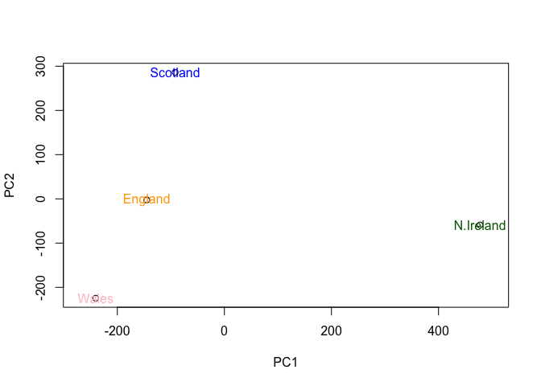

## How much variation does each PC account for?

``` r
z <- summary(pca)
z$importance
```

                                 PC1       PC2      PC3          PC4
    Standard deviation     324.15019 212.74780 73.87622 2.921348e-14
    Proportion of Variance   0.67444   0.29052  0.03503 0.000000e+00
    Cumulative Proportion    0.67444   0.96497  1.00000 1.000000e+00

``` r
#visualizing the above
barplot(z$importance, xlab="Principal Component", ylab="Percent Variation")
```

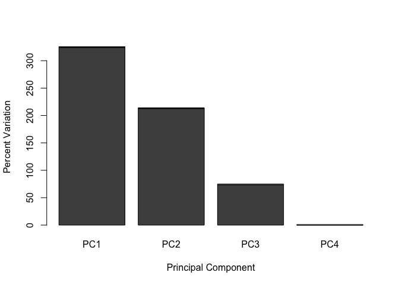

## Digging Deeper: Variable Loadings

``` r
## Lets focus on PC1 as it accounts for > 90% of variance 
par(mar=c(10, 3, 0.35, 0))
barplot( pca$rotation[,1], las=2 )
```


> Q8: Generate a similar ‘loadings plot’ for PC2. What two food groups
> feature prominantely and what does PC2 maninly tell us about?

``` r
par(mar=c(10, 3, 0.35, 0))
barplot( pca$rotation[,2], las = 2)
```


Fresh potatoes and soft drinks contribute to the PC2 loadings the most.
The negative PC loading of fresh potatoes implies that Wales consume
more of these than the others. And vice versa with soft drinks (Scotland
consumes more of these than the rest)

## Using ggplot for these figures

``` r
library(ggplot2)

df <- as.data.frame(pca$x)
df_lab <- tibble::rownames_to_column(df, "Country")

# Our first basic plot
ggplot(df_lab) + 
  aes(PC1, PC2, col=Country) + 
  geom_point()
```

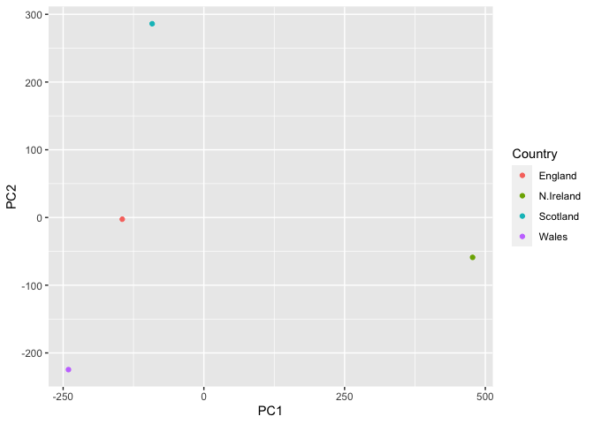

Make it look nicer!

``` r
 ggplot(df_lab) + 
  aes(PC1, PC2, col=Country, label=Country) + 
  geom_hline(yintercept = 0, col="gray") +
  geom_vline(xintercept = 0, col="gray") +
  geom_point(show.legend = FALSE) +
  geom_label(hjust=1, nudge_x = -10, show.legend = FALSE) +
  expand_limits(x = c(-300,500)) +
  xlab("PC1 (67.4%)") +
  ylab("PC2 (28%)") +
  theme_bw()
```

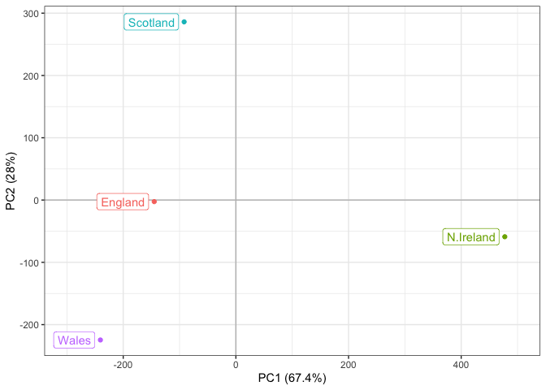

Looking at loadings…

``` r
ld <- as.data.frame(pca$rotation)
ld_lab <- tibble::rownames_to_column(ld, "Food")

ggplot(ld_lab) +
  aes(PC1, Food) +
  geom_col() 
```

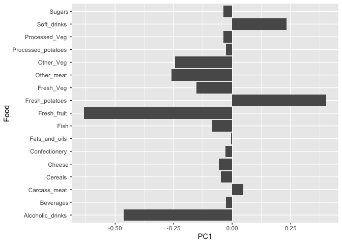
