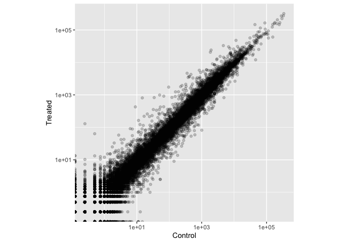
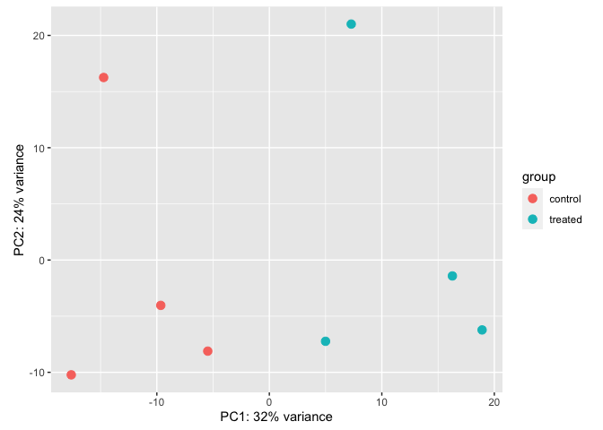
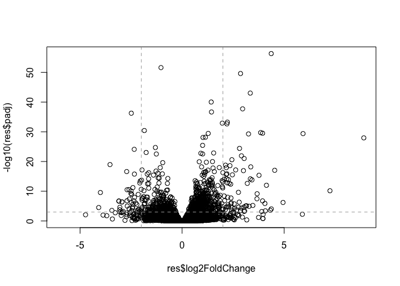
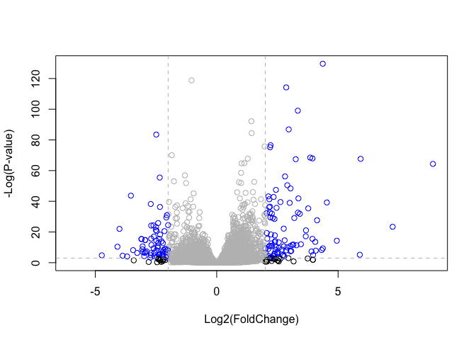
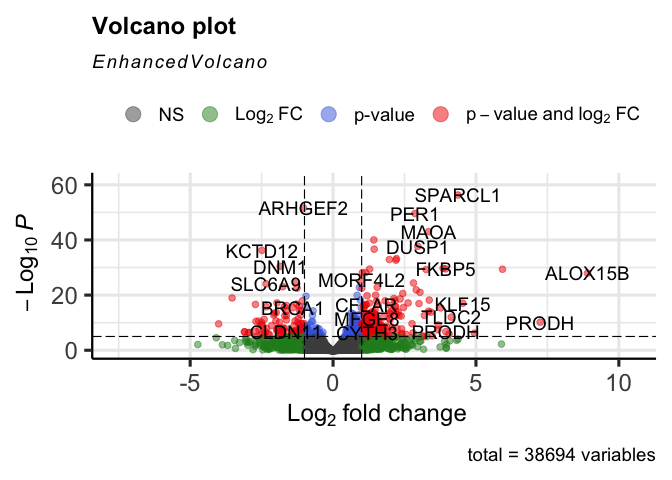

# Class 13: RNASeq Analysis with DESeq2
Jason Hsiao (PID: A15871650)

The data for this hands-on session comes from a published RNA-seq
experiment where airway smooth muscle cells were treated with
dexamethasone, a synthetic glucocorticoid steroid with anti-inflammatory
effects (Himes et al. 2014).

## Libraries

``` r
library(BiocManager)
library(DESeq2)
```

## Data Import

``` r
counts <- read.csv("airway_scaledcounts.csv", row.names=1)
metadata <- read.csv("airway_metadata.csv")
```

> Q1. How many genes are in this dataset?

``` r
nrow(counts)
```

    [1] 38694

> Q2. How many ‘control’ cell lines do we have?

``` r
sum(metadata$dex == "control")
```

    [1] 4

I want to compare the control to the treated columns. To do this I
will - Step 1. Identify and extract the “control” columns. - Step 2.
Calculate the mean value per gene for all these “control” columns. -
Step 3. Do the same for “treated” columns. - Step 4. Compare the
`control.mean` and `treated.mean` values.

Step 1:

              id     dex celltype     geo_id
    1 SRR1039508 control   N61311 GSM1275862
    3 SRR1039512 control  N052611 GSM1275866
    5 SRR1039516 control  N080611 GSM1275870
    7 SRR1039520 control  N061011 GSM1275874

    ENSG00000000003 ENSG00000000005 ENSG00000000419 ENSG00000000457 ENSG00000000460 
             900.75            0.00          520.50          339.75           97.25 
    ENSG00000000938 
               0.75 

Repeating for “treated” columns

``` r
treated.inds <- metadata$dex == "treated" #control column indices
metadata[treated.inds, ] #obtaining rows that are "control"
```

              id     dex celltype     geo_id
    2 SRR1039509 treated   N61311 GSM1275863
    4 SRR1039513 treated  N052611 GSM1275867
    6 SRR1039517 treated  N080611 GSM1275871
    8 SRR1039521 treated  N061011 GSM1275875

``` r
#Step 2: calculating mean value per gene ('SummarizedExperiment')
treated.mean <- rowMeans(counts[, treated.inds])

head(treated.mean) #confirming it worked
```

    ENSG00000000003 ENSG00000000005 ENSG00000000419 ENSG00000000457 ENSG00000000460 
             658.00            0.00          546.00          316.50           78.75 
    ENSG00000000938 
               0.00 

We will combine our meancount data for bookkeeping purposes
(visualizing, etc)…

``` r
meancounts <- data.frame(control.mean, treated.mean)
```

Let’s see what these count values look like…

``` r
library(ggplot2)
ggplot(meancounts, aes(control.mean, treated.mean)) +
        geom_point(alpha = 0.2) +
        xlab("Control") +
        ylab("Treated") +
        scale_x_log10() +
        scale_y_log10() +
        coord_quickmap()
```

    Warning: Transformation introduced infinite values in continuous x-axis

    Warning: Transformation introduced infinite values in continuous y-axis



We are going to add log2(FC) as a column of data to `meancounts` results
table.

``` r
meancounts$log2fc <- log2(meancounts$treated.mean/meancounts$control.mean)
head(meancounts)
```

                    control.mean treated.mean      log2fc
    ENSG00000000003       900.75       658.00 -0.45303916
    ENSG00000000005         0.00         0.00         NaN
    ENSG00000000419       520.50       546.00  0.06900279
    ENSG00000000457       339.75       316.50 -0.10226805
    ENSG00000000460        97.25        78.75 -0.30441833
    ENSG00000000938         0.75         0.00        -Inf

``` r
#notice we have a few genes that have zero reads. Let's remove these and make it to an object 'mycounts'
library(dplyr)
```


    Attaching package: 'dplyr'

    The following object is masked from 'package:Biobase':

        combine

    The following object is masked from 'package:matrixStats':

        count

    The following objects are masked from 'package:GenomicRanges':

        intersect, setdiff, union

    The following object is masked from 'package:GenomeInfoDb':

        intersect

    The following objects are masked from 'package:IRanges':

        collapse, desc, intersect, setdiff, slice, union

    The following objects are masked from 'package:S4Vectors':

        first, intersect, rename, setdiff, setequal, union

    The following objects are masked from 'package:BiocGenerics':

        combine, intersect, setdiff, union

    The following objects are masked from 'package:stats':

        filter, lag

    The following objects are masked from 'package:base':

        intersect, setdiff, setequal, union

``` r
mycounts <- subset(meancounts, ((meancounts[,1] > 0) & (meancounts[,2] > 0))) 

  #i.e. subset meancounts ONLY IF, for a gene, control.mean column is greater than zero AND treated.mean column is greater than zero
```

> Q. How many genes do I have left

``` r
nrow(mycounts)
```

    [1] 21817

> Q. How many genes are “upregulated” i.e. have a log2(FC) greater than
> +2?

``` r
sum(mycounts$log2fc > +2)
```

    [1] 250

> Q. How many genes are “downregulated” i.e. have a log2(FC) below than
> -2?

``` r
sum(mycounts$log2fc < -2)
```

    [1] 367

## Running DESeq2

Setting up DESeq2 object

``` r
dds <- DESeqDataSetFromMatrix(countData = counts,
                               colData = metadata,
                               design = ~ dex)
```

    converting counts to integer mode

    Warning in DESeqDataSet(se, design = design, ignoreRank): some variables in
    design formula are characters, converting to factors

``` r
dds
```

    class: DESeqDataSet 
    dim: 38694 8 
    metadata(1): version
    assays(1): counts
    rownames(38694): ENSG00000000003 ENSG00000000005 ... ENSG00000283120
      ENSG00000283123
    rowData names(0):
    colnames(8): SRR1039508 SRR1039509 ... SRR1039520 SRR1039521
    colData names(4): id dex celltype geo_id

``` r
#QC by PCA Analysis
vsd <- vst(dds, blind = FALSE)
plotPCA(vsd, intgroup = c("dex"))
```



Running DESeq analysis on dds (DESeq2 object)

``` r
dds <- DESeq(dds, test = "LRT", reduced= ~1)
```

    estimating size factors

    estimating dispersions

    gene-wise dispersion estimates

    mean-dispersion relationship

    final dispersion estimates

    fitting model and testing

``` r
res <- results(dds)
```

A common summary visualization is called a Volcano plot.

``` r
plot(res$log2FoldChange, -log10(res$padj))

# Add some cut-off lines
abline(v=c(-2,2), col="darkgray", lty=2)
abline(h=-log(0.05), col="darkgray", lty=2)
```



``` r
# Setup our custom point color vector 
mycols <- rep("gray", nrow(res)) #repeat color gray for all genes in results
mycols[ abs(res$log2FoldChange) > 2 ]  <- "black" #color genes that are upregulated and downregulated, using absolute value function, as black  

inds <- (res$padj < 0.05) & (abs(res$log2FoldChange) > 2 ) 
mycols[ inds ] <- "blue" #color genes upregulated AND downregulated above p-value threshold to be blue


# Volcano plot with custom colors 
plot( res$log2FoldChange,  -log(res$padj), 
 col = mycols, ylab = "-Log(P-value)", xlab = "Log2(FoldChange)" )

# Cut-off lines
abline(v = c(-2,2), col = "gray", lty = 2)
abline(h = -log(0.05), col = "gray", lty = 2)
```



## Adding annotation data

We want to give meaning to our ensemble IDs into understandable gene
names and their identifiers that other databases use for downstream use:

``` r
library("AnnotationDbi")
```


    Attaching package: 'AnnotationDbi'

    The following object is masked from 'package:dplyr':

        select

``` r
library("org.Hs.eg.db")
```

``` r
columns(org.Hs.eg.db)
```

     [1] "ACCNUM"       "ALIAS"        "ENSEMBL"      "ENSEMBLPROT"  "ENSEMBLTRANS"
     [6] "ENTREZID"     "ENZYME"       "EVIDENCE"     "EVIDENCEALL"  "GENENAME"    
    [11] "GENETYPE"     "GO"           "GOALL"        "IPI"          "MAP"         
    [16] "OMIM"         "ONTOLOGY"     "ONTOLOGYALL"  "PATH"         "PFAM"        
    [21] "PMID"         "PROSITE"      "REFSEQ"       "SYMBOL"       "UCSCKG"      
    [26] "UNIPROT"     

``` r
res$symbol <- mapIds(org.Hs.eg.db,
                     keys = row.names(res), # Our gene names
                     keytype = "ENSEMBL",        # The format of our genenames
                     column = "SYMBOL",          # The new format we want to add
                     multiVals = "first") #tells it to map the identifier to the first 'hit' if it has                                               multiple
```

    'select()' returned 1:many mapping between keys and columns

``` r
head(res)
```

    log2 fold change (MLE): dex treated vs control 
    LRT p-value: '~ dex' vs '~ 1' 
    DataFrame with 6 rows and 7 columns
                      baseMean log2FoldChange     lfcSE      stat    pvalue
                     <numeric>      <numeric> <numeric> <numeric> <numeric>
    ENSG00000000003 747.194195     -0.3507030  0.168246 4.3385949 0.0372577
    ENSG00000000005   0.000000             NA        NA        NA        NA
    ENSG00000000419 520.134160      0.2061078  0.101059 4.1599480 0.0413907
    ENSG00000000457 322.664844      0.0245269  0.145145 0.0293511 0.8639708
    ENSG00000000460  87.682625     -0.1471420  0.257007 0.3282904 0.5666675
    ENSG00000000938   0.319167     -1.7322890  3.493601 0.4863134 0.4855764
                         padj      symbol
                    <numeric> <character>
    ENSG00000000003  0.164248      TSPAN6
    ENSG00000000005        NA        TNMD
    ENSG00000000419  0.177003        DPM1
    ENSG00000000457  0.959959       SCYL3
    ENSG00000000460  0.815723       FIRRM
    ENSG00000000938        NA         FGR

## Pathway analysis with R and Bioconductor

GO Uses Entrez Terms:

``` r
res$entrez <- mapIds(org.Hs.eg.db,
                     keys = row.names(res), 
                     keytype = "ENSEMBL",        
                     column = "ENTREZID",          
                     multiVals = "first") 
```

    'select()' returned 1:many mapping between keys and columns

``` r
head(res$entrez)
```

    ENSG00000000003 ENSG00000000005 ENSG00000000419 ENSG00000000457 ENSG00000000460 
             "7105"         "64102"          "8813"         "57147"         "55732" 
    ENSG00000000938 
             "2268" 

Doing it for Uniprot, and also General Gene Name. i.e. you can get
Uniprot IDs and Gene names for corresponding ENSEMBL identifier from the
databases catalogued by the org.Hs.eg.db database.

``` r
res$uniprot <- mapIds(org.Hs.eg.db,
                     keys = row.names(res), 
                     keytype = "ENSEMBL",        
                     column = "UNIPROT",          
                     multiVals = "first") 
```

    'select()' returned 1:many mapping between keys and columns

``` r
head(res$uniprot)
```

    ENSG00000000003 ENSG00000000005 ENSG00000000419 ENSG00000000457 ENSG00000000460 
       "A0A024RCI0"        "Q9H2S6"        "O60762"        "Q8IZE3"    "A0A024R922" 
    ENSG00000000938 
           "P09769" 

``` r
res$gene <- mapIds(org.Hs.eg.db,
                     keys = row.names(res), 
                     keytype = "ENSEMBL",        
                     column = "GENENAME",          
                     multiVals = "first") 
```

    'select()' returned 1:many mapping between keys and columns

``` r
head(res$gene)
```

                                                  ENSG00000000003 
                                                  "tetraspanin 6" 
                                                  ENSG00000000005 
                                                    "tenomodulin" 
                                                  ENSG00000000419 
    "dolichyl-phosphate mannosyltransferase subunit 1, catalytic" 
                                                  ENSG00000000457 
                                       "SCY1 like pseudokinase 3" 
                                                  ENSG00000000460 
      "FIGNL1 interacting regulator of recombination and mitosis" 
                                                  ENSG00000000938 
                 "FGR proto-oncogene, Src family tyrosine kinase" 

Now we can load the packages and setup the KEGG data-sets we need. The
gageData package has pre-compiled databases mapping genes to KEGG
pathways and GO terms for common organisms. `kegg.sets.hs` is a named
list of 229 elements. Each element is a character vector of member gene
Entrez IDs for a single KEGG pathway.

``` r
library(pathview)
```

    ##############################################################################
    Pathview is an open source software package distributed under GNU General
    Public License version 3 (GPLv3). Details of GPLv3 is available at
    http://www.gnu.org/licenses/gpl-3.0.html. Particullary, users are required to
    formally cite the original Pathview paper (not just mention it) in publications
    or products. For details, do citation("pathview") within R.

    The pathview downloads and uses KEGG data. Non-academic uses may require a KEGG
    license agreement (details at http://www.kegg.jp/kegg/legal.html).
    ##############################################################################

``` r
library(gage)
```

``` r
library(gageData)

data(kegg.sets.hs)

# Examine the first 2 pathways in this kegg set for humans
head(kegg.sets.hs, 2)
```

    $`hsa00232 Caffeine metabolism`
    [1] "10"   "1544" "1548" "1549" "1553" "7498" "9"   

    $`hsa00983 Drug metabolism - other enzymes`
     [1] "10"     "1066"   "10720"  "10941"  "151531" "1548"   "1549"   "1551"  
     [9] "1553"   "1576"   "1577"   "1806"   "1807"   "1890"   "221223" "2990"  
    [17] "3251"   "3614"   "3615"   "3704"   "51733"  "54490"  "54575"  "54576" 
    [25] "54577"  "54578"  "54579"  "54600"  "54657"  "54658"  "54659"  "54963" 
    [33] "574537" "64816"  "7083"   "7084"   "7172"   "7363"   "7364"   "7365"  
    [41] "7366"   "7367"   "7371"   "7372"   "7378"   "7498"   "79799"  "83549" 
    [49] "8824"   "8833"   "9"      "978"   

The main gage() function requires a named vector of fold changes, where
the names of the values are the Entrez gene IDs.

Note that we used the mapIDs() function above to obtain Entrez gene IDs
(stored in `res$entrez`) and we have the fold change results from DESeq2
analysis (stored in `res$log2FoldChange`).

``` r
foldchanges = res$log2FoldChange
names(foldchanges) = res$entrez
head(foldchanges)
```

           7105       64102        8813       57147       55732        2268 
    -0.35070302          NA  0.20610777  0.02452695 -0.14714205 -1.73228897 

Now, let’s run the gage pathway analysis.

``` r
keggres = gage(foldchanges, gsets=kegg.sets.hs)
```

Look at the first three down (less) pathways

``` r
head(keggres$less, 3)
```

                                          p.geomean stat.mean        p.val
    hsa05332 Graft-versus-host disease 0.0004250461 -3.473346 0.0004250461
    hsa04940 Type I diabetes mellitus  0.0017820293 -3.002352 0.0017820293
    hsa05310 Asthma                    0.0020045888 -3.009050 0.0020045888
                                            q.val set.size         exp1
    hsa05332 Graft-versus-host disease 0.09053483       40 0.0004250461
    hsa04940 Type I diabetes mellitus  0.14232581       42 0.0017820293
    hsa05310 Asthma                    0.14232581       29 0.0020045888

``` r
pathview(gene.data=foldchanges, pathway.id="hsa05310")
```

    'select()' returned 1:1 mapping between keys and columns

    Info: Working in directory /Users/jasonhsiao/Library/CloudStorage/OneDrive-UCSanDiego/Grad/F23_Bioinformatics_BGGN213/BGGN213_F23/Class13

    Info: Writing image file hsa05310.pathview.png

Each `keggres$less` and `keggres$greater` object is data matrix with
gene sets as rows sorted by p-value.

Now, let’s try out the `pathview()` function from the pathview package
to make a pathway plot with our RNA-Seq expression results shown in
color. To begin with lets manually supply a pathway.id (namely the first
part of the `"hsa05310 Asthma"`) that we could see from the print out
above.

``` r
pathview(gene.data=foldchanges, pathway.id="hsa05310")
```

    'select()' returned 1:1 mapping between keys and columns

    Info: Working in directory /Users/jasonhsiao/Library/CloudStorage/OneDrive-UCSanDiego/Grad/F23_Bioinformatics_BGGN213/BGGN213_F23/Class13

    Info: Writing image file hsa05310.pathview.png

If we also want our volcano plot to look even more fancy now, we can use
the Bioconductor package `EnhancedVolcano` alongside our updated
identifier symbols:

``` r
library(EnhancedVolcano)
```

    Loading required package: ggrepel

``` r
x <- as.data.frame(res)


EnhancedVolcano(x,
    lab = x$symbol,
    x = 'log2FoldChange',
    y = 'padj')
```


