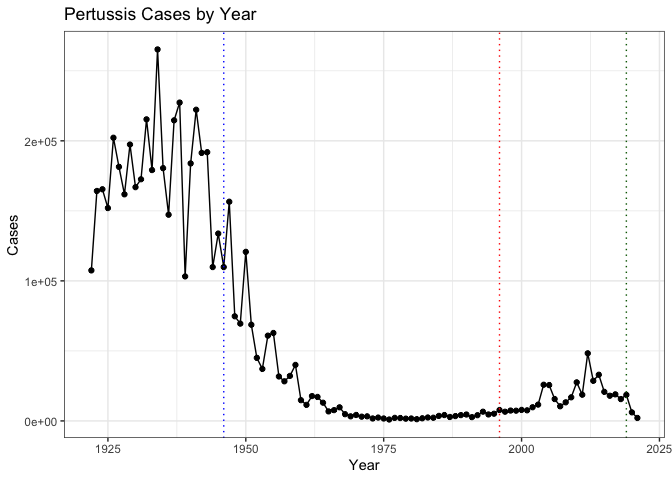
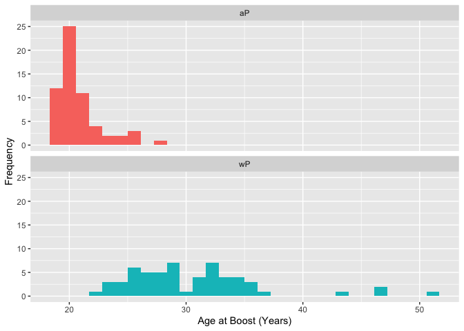
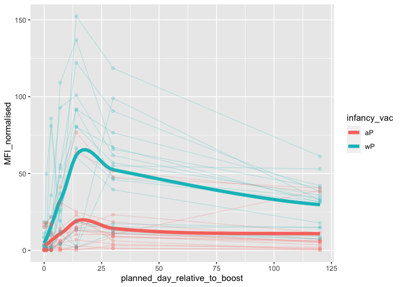
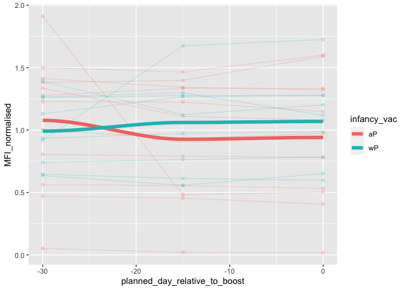
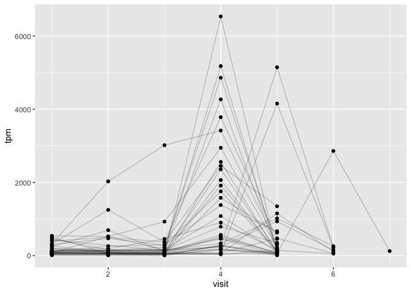
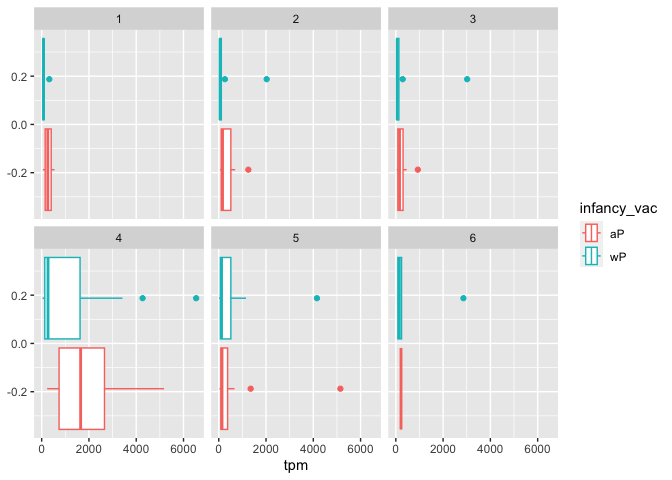

# Investigating Pertussis Resurgence
Jason Hsiao (PID: A15871650)

# Investigating Pertussis Resurgence

Libraries Used:

``` r
suppressPackageStartupMessages({
library(datapasta)
library(ggplot2)
library(jsonlite)
library(lubridate)
library(dplyr)
library(readxl)
})
```

## Pertussis by Year - CDC Data

https://www.cdc.gov/pertussis/surv-reporting/cases-by-year.html#print

Let’s visualize it!

``` r
# Visualizing
ggplot(cdc, aes(Year, Cases)) + 
  geom_point() +
  geom_line() +
  theme_bw() + 
  # Adding vlines for wP and aP vaccination rollouts
  geom_vline(xintercept = c(1946, 1996, 2019), color = c("blue", "red","darkgreen"), linetype = "dotted") +
  ggtitle("Pertussis Cases by Year")
```



## Exploring CMI-PB Data

``` r
# Reading json file and assigning to object 'subject'
subject <- read_json("https://www.cmi-pb.org/api/subject", simplifyVector = TRUE) 
# Determining Number in Dataset
summary(subject)
```

       subject_id     infancy_vac        biological_sex      ethnicity        
     Min.   :  1.00   Length:118         Length:118         Length:118        
     1st Qu.: 30.25   Class :character   Class :character   Class :character  
     Median : 59.50   Mode  :character   Mode  :character   Mode  :character  
     Mean   : 59.50                                                           
     3rd Qu.: 88.75                                                           
     Max.   :118.00                                                           
         race           year_of_birth      date_of_boost        dataset         
     Length:118         Length:118         Length:118         Length:118        
     Class :character   Class :character   Class :character   Class :character  
     Mode  :character   Mode  :character   Mode  :character   Mode  :character  
                                                                                
                                                                                
                                                                                

``` r
# Determining aP vs wP numbers in subject object
table(subject$infancy_vac)
```


    aP wP 
    60 58 

``` r
# By sex
table(subject$biological_sex)
```


    Female   Male 
        79     39 

``` r
# By race and biological sex
table(subject$race, subject$biological_sex)
```

                                               
                                                Female Male
      American Indian/Alaska Native                  0    1
      Asian                                         21   11
      Black or African American                      2    0
      More Than One Race                             9    2
      Native Hawaiian or Other Pacific Islander      1    1
      Unknown or Not Reported                       11    4
      White                                         35   20

``` r
# Average age of wP and aP individuals
subject$age <- time_length(today() - ymd(subject$year_of_birth), "year")
subject$age # overall ages
```

      [1] 37.93292 55.93429 40.93361 35.93429 32.93361 35.93429 42.93224 38.93224
      [9] 27.93429 41.93292 37.93292 41.93292 26.93224 30.93224 34.93224 36.93361
     [17] 43.93429 26.93224 29.93292 42.93224 40.93361 38.93224 32.93361 31.93429
     [25] 35.93429 40.93361 26.93224 41.93292 26.93224 35.93429 34.93224 26.93224
     [33] 33.93292 40.93361 32.93361 26.93224 25.93292 26.93224 38.93224 29.93292
     [41] 38.93224 26.93224 25.93292 25.93292 26.93224 25.93292 27.93429 25.93292
     [49] 26.93224 26.93224 26.93224 25.93292 25.93292 26.93224 26.93224 26.93224
     [57] 27.93429 26.93224 26.93224 26.93224 36.93361 30.93224 28.93361 30.93224
     [65] 33.93292 47.93429 51.93429 51.93429 33.93292 25.93292 25.93292 32.93361
     [73] 28.93361 28.93361 25.93292 25.93292 35.93429 30.93224 36.93361 31.93429
     [81] 30.93224 25.93292 24.93361 26.93224 23.93429 25.93292 23.93429 23.93429
     [89] 26.93224 24.93361 25.93292 23.93429 27.93429 24.93361 25.93292 23.93429
     [97] 37.93292 30.93224 24.93361 22.93224 20.93361 20.93361 29.93292 34.93224
    [105] 29.93292 27.93429 25.93292 28.93361 34.93224 26.93224 27.93429 27.93429
    [113] 27.93429 33.93292 21.93292 23.93429 29.93292 25.93292

``` r
ap <- subject %>% filter(infancy_vac == "aP")
round(summary(ap$age)) # ages of aP vaccinated
```

       Min. 1st Qu.  Median    Mean 3rd Qu.    Max. 
         21      26      26      26      27      30 

``` r
wp <- subject %>% filter(infancy_vac == "wP")
round(summary(wp$age)) # ages of wP vaccinated
```

       Min. 1st Qu.  Median    Mean 3rd Qu.    Max. 
         28      31      35      36      39      56 

``` r
# Age of all individuals at time of boost
subject$age_at_boost <- time_length(ymd(subject$date_of_boost) - ymd(subject$year_of_birth), "year")
subject$age_at_boost
```

      [1] 30.69678 51.07461 33.77413 28.65982 25.65914 28.77481 35.84942 34.14921
      [9] 20.56400 34.56263 30.65845 34.56263 19.56194 23.61944 27.61944 29.56331
     [17] 36.69815 19.65777 22.73511 35.65777 33.65914 31.65777 25.73580 24.70089
     [25] 28.70089 33.73580 19.73443 34.73511 19.73443 28.73648 27.73443 19.81109
     [33] 26.77344 33.81246 25.77413 19.81109 18.85010 19.81109 31.81109 22.81177
     [41] 31.84942 19.84942 18.85010 18.85010 19.90691 18.85010 20.90897 19.04449
     [49] 20.04381 19.90691 19.90691 19.00616 19.00616 20.04381 20.04381 20.07940
     [57] 21.08145 20.07940 20.07940 20.07940 32.26557 25.90007 23.90144 25.90007
     [65] 28.91992 42.92129 47.07461 47.07461 29.07324 21.07324 21.07324 28.15058
     [73] 24.15058 24.15058 21.14990 21.14990 31.20876 26.20671 32.20808 27.20876
     [81] 26.20671 21.20739 20.26557 22.26420 19.32375 21.32238 19.32375 19.32375
     [89] 22.41752 20.41889 21.41821 19.47707 23.47707 20.47639 21.47570 19.47707
     [97] 35.90965 28.73648 22.68309 20.83231 18.83368 18.83368 27.68241 32.68172
    [105] 27.68241 25.68378 23.68241 26.73785 32.73648 24.73648 25.79603 25.79603
    [113] 25.79603 31.79466 19.83299 21.91102 27.90965 24.06297

``` r
# Plotting aP vs wP ages at time of boost
ggplot(subject) +
  aes(time_length(age_at_boost),
  fill = as.factor(infancy_vac)) +
  geom_histogram(show.legend = FALSE) +
  facet_wrap(vars(infancy_vac), nrow = 2) +
  xlab("Age at Boost (Years)") +
  ylab("Frequency")
```

    `stat_bin()` using `bins = 30`. Pick better value with `binwidth`.



## Merging subject and specimen data

``` r
specimen <- read_json("https://www.cmi-pb.org/api/specimen", simplifyVector = TRUE) # Importing specimen data
titer <- read_json("https://www.cmi-pb.org/api/plasma_ab_titer", simplifyVector = TRUE) # Importing titer data

# Matching subject information (metadata) to specimen id to form a new dataframe 
meta <- inner_join(specimen, subject, by = "subject_id")
dim(meta)
```

    [1] 939  15

``` r
head(meta)
```

      specimen_id subject_id actual_day_relative_to_boost
    1           1          1                           -3
    2           2          1                            1
    3           3          1                            3
    4           4          1                            7
    5           5          1                           11
    6           6          1                           32
      planned_day_relative_to_boost specimen_type visit infancy_vac biological_sex
    1                             0         Blood     1          wP         Female
    2                             1         Blood     2          wP         Female
    3                             3         Blood     3          wP         Female
    4                             7         Blood     4          wP         Female
    5                            14         Blood     5          wP         Female
    6                            30         Blood     6          wP         Female
                   ethnicity  race year_of_birth date_of_boost      dataset
    1 Not Hispanic or Latino White    1986-01-01    2016-09-12 2020_dataset
    2 Not Hispanic or Latino White    1986-01-01    2016-09-12 2020_dataset
    3 Not Hispanic or Latino White    1986-01-01    2016-09-12 2020_dataset
    4 Not Hispanic or Latino White    1986-01-01    2016-09-12 2020_dataset
    5 Not Hispanic or Latino White    1986-01-01    2016-09-12 2020_dataset
    6 Not Hispanic or Latino White    1986-01-01    2016-09-12 2020_dataset
           age age_at_boost
    1 37.93292     30.69678
    2 37.93292     30.69678
    3 37.93292     30.69678
    4 37.93292     30.69678
    5 37.93292     30.69678
    6 37.93292     30.69678

``` r
# Adding antibody titer (collected in specimens) information to meta
abdata <- inner_join(titer, meta, by = "specimen_id")
dim(abdata)
```

    [1] 41810    22

``` r
head(abdata)
```

      specimen_id isotype is_antigen_specific antigen        MFI MFI_normalised
    1           1     IgE               FALSE   Total 1110.21154       2.493425
    2           1     IgE               FALSE   Total 2708.91616       2.493425
    3           1     IgG                TRUE      PT   68.56614       3.736992
    4           1     IgG                TRUE     PRN  332.12718       2.602350
    5           1     IgG                TRUE     FHA 1887.12263      34.050956
    6           1     IgE                TRUE     ACT    0.10000       1.000000
       unit lower_limit_of_detection subject_id actual_day_relative_to_boost
    1 UG/ML                 2.096133          1                           -3
    2 IU/ML                29.170000          1                           -3
    3 IU/ML                 0.530000          1                           -3
    4 IU/ML                 6.205949          1                           -3
    5 IU/ML                 4.679535          1                           -3
    6 IU/ML                 2.816431          1                           -3
      planned_day_relative_to_boost specimen_type visit infancy_vac biological_sex
    1                             0         Blood     1          wP         Female
    2                             0         Blood     1          wP         Female
    3                             0         Blood     1          wP         Female
    4                             0         Blood     1          wP         Female
    5                             0         Blood     1          wP         Female
    6                             0         Blood     1          wP         Female
                   ethnicity  race year_of_birth date_of_boost      dataset
    1 Not Hispanic or Latino White    1986-01-01    2016-09-12 2020_dataset
    2 Not Hispanic or Latino White    1986-01-01    2016-09-12 2020_dataset
    3 Not Hispanic or Latino White    1986-01-01    2016-09-12 2020_dataset
    4 Not Hispanic or Latino White    1986-01-01    2016-09-12 2020_dataset
    5 Not Hispanic or Latino White    1986-01-01    2016-09-12 2020_dataset
    6 Not Hispanic or Latino White    1986-01-01    2016-09-12 2020_dataset
           age age_at_boost
    1 37.93292     30.69678
    2 37.93292     30.69678
    3 37.93292     30.69678
    4 37.93292     30.69678
    5 37.93292     30.69678
    6 37.93292     30.69678

``` r
# Number of specimens for each isotype of Ig in abdata 
table(abdata$isotype)
```


     IgE  IgG IgG1 IgG2 IgG3 IgG4 
    6698 3240 7968 7968 7968 7968 

``` r
# Specimens by visit type
table(abdata$visit)
```


       1    2    3    4    5    6    7    8 
    6390 6460 6530 5900 5900 5475 5075   80 

## Examining IgG1 Ab Titer Levels

We notice from above that visits 8-12 have considerable less samples, so
we will remove those. Additionally, we want to look at IgG1 only:

``` r
ig1 <- abdata %>% filter(isotype == "IgG1", antigen =="PT", dataset == "2021_dataset")
head(ig1)
```

      specimen_id isotype is_antigen_specific antigen       MFI MFI_normalised unit
    1         468    IgG1               FALSE      PT 16.601283       3.194997  MFI
    2         469    IgG1               FALSE      PT 29.101283       5.600682  MFI
    3         470    IgG1               FALSE      PT 60.851283      11.711123  MFI
    4         471    IgG1               FALSE      PT 22.601283       4.349726  MFI
    5         472    IgG1               FALSE      PT  9.601283       1.847813  MFI
    6         473    IgG1               FALSE      PT 56.601283      10.893190  MFI
      lower_limit_of_detection subject_id actual_day_relative_to_boost
    1                0.5980123         61                           -4
    2                0.5980123         61                            1
    3                0.5980123         61                            3
    4                0.5980123         61                            7
    5                0.5980123         61                           14
    6                0.5980123         61                           30
      planned_day_relative_to_boost specimen_type visit infancy_vac biological_sex
    1                             0         Blood     1          wP         Female
    2                             1         Blood     2          wP         Female
    3                             3         Blood     3          wP         Female
    4                             7         Blood     4          wP         Female
    5                            14         Blood     5          wP         Female
    6                            30         Blood     6          wP         Female
                   ethnicity                    race year_of_birth date_of_boost
    1 Not Hispanic or Latino Unknown or Not Reported    1987-01-01    2019-04-08
    2 Not Hispanic or Latino Unknown or Not Reported    1987-01-01    2019-04-08
    3 Not Hispanic or Latino Unknown or Not Reported    1987-01-01    2019-04-08
    4 Not Hispanic or Latino Unknown or Not Reported    1987-01-01    2019-04-08
    5 Not Hispanic or Latino Unknown or Not Reported    1987-01-01    2019-04-08
    6 Not Hispanic or Latino Unknown or Not Reported    1987-01-01    2019-04-08
           dataset      age age_at_boost
    1 2021_dataset 36.93361     32.26557
    2 2021_dataset 36.93361     32.26557
    3 2021_dataset 36.93361     32.26557
    4 2021_dataset 36.93361     32.26557
    5 2021_dataset 36.93361     32.26557
    6 2021_dataset 36.93361     32.26557

``` r
# Plotting ig1 (antigen-specific IgG1 levels by visit)
ggplot(ig1) +
  aes(planned_day_relative_to_boost, MFI_normalised, col = infancy_vac) +
  geom_line(aes(group = subject_id), alpha = 0.2) +
  geom_smooth(se = FALSE, span = 0.4, linewidth = 2) +
  geom_point(alpha = 0.2)
```

    `geom_smooth()` using method = 'loess' and formula = 'y ~ x'

    Warning in simpleLoess(y, x, w, span, degree = degree, parametric = parametric,
    : pseudoinverse used at -0.6

    Warning in simpleLoess(y, x, w, span, degree = degree, parametric = parametric,
    : neighborhood radius 3.6

    Warning in simpleLoess(y, x, w, span, degree = degree, parametric = parametric,
    : reciprocal condition number 1.7596e-16

    Warning in simpleLoess(y, x, w, span, degree = degree, parametric = parametric,
    : There are other near singularities as well. 11364

    Warning in simpleLoess(y, x, w, span, degree = degree, parametric = parametric,
    : pseudoinverse used at -0.6

    Warning in simpleLoess(y, x, w, span, degree = degree, parametric = parametric,
    : neighborhood radius 3.6

    Warning in simpleLoess(y, x, w, span, degree = degree, parametric = parametric,
    : reciprocal condition number 1.6196e-16

    Warning in simpleLoess(y, x, w, span, degree = degree, parametric = parametric,
    : There are other near singularities as well. 11364



``` r
# For 2022 dataset?
ig2 <- abdata %>% filter(isotype == "IgG1", antigen =="PT", dataset == "2022_dataset")
head(ig2,15)
```

       specimen_id isotype is_antigen_specific antigen       MFI MFI_normalised
    1          820    IgG1                TRUE      PT 0.7912533      0.7912533
    2          850    IgG1                TRUE      PT 1.2769221      1.2769221
    3          781    IgG1                TRUE      PT 1.4652814      1.4652814
    4          839    IgG1                TRUE      PT 0.6458760      0.6458760
    5          732    IgG1                TRUE      PT 1.1187943      1.1187943
    6          930    IgG1                TRUE      PT 1.0000000      1.0000000
    7          761    IgG1                TRUE      PT 0.4554610      0.4554610
    8          861    IgG1                TRUE      PT 0.5325258      0.5325258
    9          829    IgG1                TRUE      PT 1.2279148      1.2279148
    10         819    IgG1                TRUE      PT 0.8050529      0.8050529
    11         882    IgG1                TRUE      PT 0.5035704      0.5035704
    12         900    IgG1                TRUE      PT 1.3800313      1.3800313
    13         891    IgG1                TRUE      PT 1.1228019      1.1228019
    14         911    IgG1                TRUE      PT 1.1101224      1.1101224
    15         762    IgG1                TRUE      PT 0.4062174      0.4062174
       unit lower_limit_of_detection subject_id actual_day_relative_to_boost
    1   MFI               0.01673433        106                          -15
    2   MFI               0.01673433        109                          -14
    3   MFI               0.01673433        102                          -14
    4   MFI               0.01673433        108                          -32
    5   MFI               0.01673433         97                            0
    6   MFI               0.01673433        118                          -52
    7   MFI               0.01673433        100                          -14
    8   MFI               0.01673433        110                            0
    9   MFI               0.01673433        107                          -28
    10  MFI               0.01673433        106                          -30
    11  MFI               0.01673433        112                            0
    12  MFI               0.01673433        115                          -32
    13  MFI               0.01673433        114                          -14
    14  MFI               0.01673433        116                          -14
    15  MFI               0.01673433        100                            0
       planned_day_relative_to_boost specimen_type visit infancy_vac biological_sex
    1                            -15         Blood     2          aP         Female
    2                            -15         Blood     2          wP         Female
    3                            -15         Blood     2          aP           Male
    4                            -30         Blood     1          wP         Female
    5                              0         Blood     3          wP           Male
    6                            -30         Blood     1          aP           Male
    7                            -15         Blood     4          aP         Female
    8                              0         Blood     3          aP         Female
    9                            -30         Blood     1          aP         Female
    10                           -30         Blood     2          aP         Female
    11                             0         Blood     3          aP           Male
    12                           -30         Blood     1          aP         Female
    13                           -15         Blood     2          wP           Male
    14                           -15         Blood     2          aP           Male
    15                             0         Blood     5          aP         Female
                    ethnicity  race year_of_birth date_of_boost      dataset
    1  Not Hispanic or Latino White    1996-01-01    2021-09-07 2022_dataset
    2  Not Hispanic or Latino White    1989-01-01    2021-09-27 2022_dataset
    3  Not Hispanic or Latino White    2003-01-01    2021-11-01 2022_dataset
    4  Not Hispanic or Latino White    1995-01-01    2021-09-27 2022_dataset
    5  Not Hispanic or Latino White    1986-01-01    2021-11-29 2022_dataset
    6  Not Hispanic or Latino Asian    1998-01-01    2022-01-24 2022_dataset
    7  Not Hispanic or Latino White    2001-01-01    2021-11-01 2022_dataset
    8      Hispanic or Latino White    1997-01-01    2021-09-27 2022_dataset
    9  Not Hispanic or Latino Asian    1998-01-01    2021-09-07 2022_dataset
    10 Not Hispanic or Latino White    1996-01-01    2021-09-07 2022_dataset
    11 Not Hispanic or Latino White    1996-01-01    2021-10-18 2022_dataset
    12 Not Hispanic or Latino Asian    2002-01-01    2021-11-01 2022_dataset
    13 Not Hispanic or Latino Asian    1990-01-01    2021-10-18 2022_dataset
    14 Not Hispanic or Latino White    2000-01-01    2021-11-29 2022_dataset
    15 Not Hispanic or Latino White    2001-01-01    2021-11-01 2022_dataset
            age age_at_boost
    1  27.93429     25.68378
    2  34.93224     32.73648
    3  20.93361     18.83368
    4  28.93361     26.73785
    5  37.93292     35.90965
    6  25.93292     24.06297
    7  22.93224     20.83231
    8  26.93224     24.73648
    9  25.93292     23.68241
    10 27.93429     25.68378
    11 27.93429     25.79603
    12 21.93292     19.83299
    13 33.93292     31.79466
    14 23.93429     21.91102
    15 22.93224     20.83231

``` r
ggplot(ig2) +
  aes(planned_day_relative_to_boost, MFI_normalised, col = infancy_vac) +
  geom_line(aes(group = subject_id), alpha = 0.2) +
  geom_smooth(se = FALSE, span = 0.4, linewidth = 2) +
  geom_point(alpha = 0.2)
```

    `geom_smooth()` using method = 'loess' and formula = 'y ~ x'

    Warning in simpleLoess(y, x, w, span, degree = degree, parametric = parametric,
    : pseudoinverse used at -30.15

    Warning in simpleLoess(y, x, w, span, degree = degree, parametric = parametric,
    : neighborhood radius 15.15

    Warning in simpleLoess(y, x, w, span, degree = degree, parametric = parametric,
    : reciprocal condition number 0

    Warning in simpleLoess(y, x, w, span, degree = degree, parametric = parametric,
    : There are other near singularities as well. 229.52

    Warning in simpleLoess(y, x, w, span, degree = degree, parametric = parametric,
    : pseudoinverse used at -30.15

    Warning in simpleLoess(y, x, w, span, degree = degree, parametric = parametric,
    : neighborhood radius 15.15

    Warning in simpleLoess(y, x, w, span, degree = degree, parametric = parametric,
    : reciprocal condition number 0

    Warning in simpleLoess(y, x, w, span, degree = degree, parametric = parametric,
    : There are other near singularities as well. 229.52



## CMI-PB RNAseq Data

``` r
#Reading JSON file of RNAseq data, specifically for IghG1 gene
rna <- read_json("https://www.cmi-pb.org/api/v2/rnaseq?versioned_ensembl_gene_id=eq.ENSG00000211896.7", simplifyVector = TRUE) 

#Joining RNAseq data of specimens to specimen ID in meta
ssrna <- inner_join(rna, meta, by = "specimen_id")

#Visualizing reads of IghG1 by visit
ggplot(ssrna) +
  aes(visit, tpm, group = subject_id) +
  geom_point() +
  geom_line(alpha = 0.2)
```



``` r
#Are there differences by vaccination status? (Removing Visit 7: no aP data)
ssrna %>%
  filter(visit != 7) %>%
    ggplot() +
    aes(tpm, col = infancy_vac) +
    geom_boxplot() +
    facet_wrap(vars(visit), nrow = 2) 
```


